PensPlace Pacman Documentation
==============================

Contents
========

* [PensPlace Pacman](#pensplace-pacman)
	* [StartScreen](#startscreen)
	* [OnStart](#onstart)
* [Connections](#connections)
* [Screens](#screens)
	* [Loading Screen](#loading-screen)
		* [Global variables](#global-variables)
		* ['Loading Screen' As screen](#loading-screen-as-screen)
	* [Game Screen](#game-screen)
		* [Global variables](#global-variables)
		* ['Game Screen' As screen](#game-screen-as-screen)
		* [Image2_5 As image](#image2_5-as-image)
		* [Image2_6 As image](#image2_6-as-image)
		* [Image2_7 As image](#image2_7-as-image)
		* [Image2_8 As image](#image2_8-as-image)
		* [Image2_9 As image](#image2_9-as-image)
		* [Image2_10 As image](#image2_10-as-image)
		* [Image2_11 As image](#image2_11-as-image)
		* [Image2_12 As image](#image2_12-as-image)
		* [Image2_123 As image](#image2_123-as-image)
		* [Image2_122 As image](#image2_122-as-image)
		* [Image2_125 As image](#image2_125-as-image)
		* [Image2_124 As image](#image2_124-as-image)
		* [Image2_126 As image](#image2_126-as-image)
		* [Image2_127 As image](#image2_127-as-image)
		* [Image2_129 As image](#image2_129-as-image)
		* [Image2_128 As image](#image2_128-as-image)
		* [Image2_120 As image](#image2_120-as-image)
		* [Image2_121 As image](#image2_121-as-image)
		* [Image2_131 As image](#image2_131-as-image)
		* [init1 As text](#init1-as-text)
		* [init2 As text](#init2-as-text)
		* [init3 As text](#init3-as-text)
		* [Image2_137 As image](#image2_137-as-image)
		* [Image2_138 As image](#image2_138-as-image)
		* [Image2_201 As image](#image2_201-as-image)
		* [Image2_202 As image](#image2_202-as-image)
		* [Image2_203 As image](#image2_203-as-image)
		* [Image2_139 As image](#image2_139-as-image)
		* [Image2_140 As image](#image2_140-as-image)
		* [Image2_204 As image](#image2_204-as-image)
		* [Image2_205 As image](#image2_205-as-image)
		* [Image2_206 As image](#image2_206-as-image)
		* [Image2_207 As image](#image2_207-as-image)
		* [Image2_141 As image](#image2_141-as-image)
		* [Image2_142 As image](#image2_142-as-image)
		* [Image2_208 As image](#image2_208-as-image)
		* [Image2_209 As image](#image2_209-as-image)
		* [Image2_210 As image](#image2_210-as-image)
		* [Image2_211 As image](#image2_211-as-image)
		* [Image2_143 As image](#image2_143-as-image)
		* [Image2_31 As image](#image2_31-as-image)
		* [Image2_44 As image](#image2_44-as-image)
		* [Image2_45 As image](#image2_45-as-image)
		* [startLevel As button](#startlevel-as-button)
		* [GhostStarter As button](#ghoststarter-as-button)
		* [startGhostOne As button](#startghostone-as-button)
		* [startGhostTwo As button](#startghosttwo-as-button)
		* [startGhostThree As button](#startghostthree-as-button)
		* [startGhostFour As button](#startghostfour-as-button)
		* [GhostCaught As button](#ghostcaught-as-button)
		* [PacmanCaught As button](#pacmancaught-as-button)
		* [GameOver As button](#gameover-as-button)
		* [EndLevel As button](#endlevel-as-button)
		* [keyboardInput As text](#keyboardinput-as-text)
		* [maze As image](#maze-as-image)
		* [ghost2 As image](#ghost2-as-image)
		* [ghost3 As image](#ghost3-as-image)
		* [ghost4 As image](#ghost4-as-image)
		* [ghost1 As image](#ghost1-as-image)
		* [pacman As image](#pacman-as-image)
		* [Image2_14 As image](#image2_14-as-image)
		* [Image2_13 As image](#image2_13-as-image)
		* [Image2_16 As image](#image2_16-as-image)
		* [Image2_17 As image](#image2_17-as-image)
		* [Image2_18 As image](#image2_18-as-image)
		* [Image2_20 As image](#image2_20-as-image)
		* [Image2_19 As image](#image2_19-as-image)
		* [Image2_15 As image](#image2_15-as-image)
		* [Image2 As image](#image2-as-image)
		* [Image2_2 As image](#image2_2-as-image)
		* [Image2_3 As image](#image2_3-as-image)
		* [Image2_116 As image](#image2_116-as-image)
		* [Image2_108 As image](#image2_108-as-image)
		* [Image2_107 As image](#image2_107-as-image)
		* [Image2_110 As image](#image2_110-as-image)
		* [Image2_109 As image](#image2_109-as-image)
		* [Image2_111 As image](#image2_111-as-image)
		* [Image2_112 As image](#image2_112-as-image)
		* [Image2_114 As image](#image2_114-as-image)
		* [Image2_113 As image](#image2_113-as-image)
		* [Image2_104 As image](#image2_104-as-image)
		* [Image2_106 As image](#image2_106-as-image)
		* [Image2_115 As image](#image2_115-as-image)
		* [Image2_105 As image](#image2_105-as-image)
		* [Image2_178 As image](#image2_178-as-image)
		* [Image2_177 As image](#image2_177-as-image)
		* [Image2_179 As image](#image2_179-as-image)
		* [Image2_180 As image](#image2_180-as-image)
		* [Image2_182 As image](#image2_182-as-image)
		* [Image2_181 As image](#image2_181-as-image)
* [Global Variables](#global-variables)
	* [Developer](#developer)
	* [g1Xold](#g1xold)
	* [score](#score)
	* [g1Yold](#g1yold)
	* [g2Yold](#g2yold)
	* [varInput](#varinput)
	* [g4Yold](#g4yold)
	* [fruitLive](#fruitlive)
	* [g4Xold](#g4xold)
	* [Color4JSON](#color4json)
	* [startFruitTimer](#startfruittimer)
	* [StartLoadingScreenTimer](#startloadingscreentimer)
	* [gbl_menu_default](#gbl_menu_default)
	* [g3Yold](#g3yold)
	* [\nscore](#nscore)
	* [varXold](#varxold)
	* [varRefresh](#varrefresh)
	* [LoadingText](#loadingtext)
	* [fruitDuration](#fruitduration)
	* [g3Xold](#g3xold)
	* [\nscore](#nscore)
	* [g2Xold](#g2xold)
	* [varYold](#varyold)
* [DataSources](#datasources)
	* [Collections](#collections)
		* [colPillsNotEaten](#colpillsnoteaten)
		* [\ncolDirectionsAvailableg2](#ncoldirectionsavailableg2)
		* [\ncolDirectionsAvailableG1](#ncoldirectionsavailableg1)
		* [\ncolPowerPills](#ncolpowerpills)
		* [ghostsHome](#ghostshome)
		* [colPowerPills](#colpowerpills)
		* [ghosts](#ghosts)
		* [colPills](#colpills)
		* [fruits](#fruits)
		* [\ncolDirectionsAvailableg3](#ncoldirectionsavailableg3)
		* [\nlevelsCompleted](#nlevelscompleted)
		* [\ncolPills](#ncolpills)
		* [\ncolDirectionsAvailableg4](#ncoldirectionsavailableg4)
		* [colPowerPillsNotEaten](#colpowerpillsnoteaten)
  
  

# PensPlace Pacman
  

## StartScreen


```typescript
'Loading Screen'
```  
  

## OnStart


```typescript
///////////////////////////////////////////////////////////////////////////////////////
//                                                                                   //
//  Trustmarque Branded Tablet Template - Feb 2022                                   //
//                                                                                   //
///////////////////////////////////////////////////////////////////////////////////////
//    This section sets the default colours for all default items within the App.    //
//           This will mean all default items are branded 'automagically'.           //
///////////////////////////////////////////////////////////////////////////////////////
//          -- Set Colours & Values --                                               //
///////////////////////////////////////////////////////////////////////////////////////

Set(
    ThisTheme,
    {
        Name:                               "Microsoft Blue Light",

        Color1:                             RGBA(186, 202, 226, 1),
        Color2:                             RGBA( 56,  96, 178, 1),
        Color3:                             RGBA(  0,  18, 107, 1),
        Color1Text:                         RGBA( 15,  15,  15, 1),
        Color2Text:                         RGBA(245, 245, 245, 1),
        Color3Text:                         RGBA(245, 245, 245, 1),
        Color4:                             RGBA(  0,  18, 107, 1),
        Color5Alpha:                        RGBA(186, 202, 226, 0.6),
        defaultTextColor:                   RGBA( 15,  15,  15, 1),
        defaultPadding:                     10,
        defaultRadius:                      10,
        defaultBorderThickness:             1,
        defaultFocusedBorderThickness:      1,
        Font:                               Font.'Segoe UI',
        FontSize:                           14,
        DarkMode:                           false
    } 
);
Set(ThisThemeBackup, ThisTheme);

////////////////////////////////////
// -- Set Secondary Font Sizes -- //
////////////////////////////////////

Set(
    FontSizes,
    {
        TextMain:                           ThisTheme.FontSize -1,
        TextEmphasis:                       ThisTheme.FontSize +1,
        Content:                            ThisTheme.FontSize +2,
        Title:                              ThisTheme.FontSize +6,
        SubTitle:                           ThisTheme.FontSize +4,
        AddPicture:                         ThisTheme.FontSize -3
    }
);

////////////////////////////////////////////////
// -- Set Control-level default Properties -- //
////////////////////////////////////////////////

Set(
    ControlsTheme,
    {

        LabelTextColor:                     ThisTheme.defaultTextColor,
        LabelFill:                          Transparent,
        LabelBorderColor:                   ThisTheme.Color2,
        LabelFont:                          ThisTheme.Font,

        ButtonColor:                        ThisTheme.Color2Text,
        ButtonFill:                         ThisTheme.Color2,
        ButtonBorderColor:                  ThisTheme.Color1,
        ButtonHoverColor:                   ColorFade(ThisTheme.Color2Text, 20%),
        ButtonHoverFill:                    ColorFade(ThisTheme.Color2,     20%),
        ButtonHoverBorderColor:             ColorFade(ThisTheme.Color1,     20%),
        ButtonPressedColor:                 ThisTheme.Color2,
        ButtonPressedFill:                  ThisTheme.Color2Text,
        ButtonPressedBorderColor:           ThisTheme.Color2,
        ButtonFont:                         ThisTheme.Font,

        InputTextColor:                     ThisTheme.Color1Text,
        InputFill:                          ThisTheme.Color1,
        InputBorderColor:                   ThisTheme.Color2,
        InputHoverColor:                    ColorFade(ThisTheme.Color1Text, 20%),
        InputHoverFill:                     ColorFade(ThisTheme.Color1, 20%),
        InputHoverBorderColor:              ColorFade(ThisTheme.Color2, 20%),
        InputPressedColor:                  ThisTheme.Color1Text,
        InputPressedFill:                   ThisTheme.Color1,
        InputPressedBorderColor:            ColorFade(ThisTheme.Color2, 20%),
        InputFont:                          ThisTheme.Font,
        InputDelayOutput:                   true,

        PenInputInkColor:                   ThisTheme.defaultTextColor,
        PenInputBorderColor:                ThisTheme.defaultTextColor,
        PenInputInkSize:                    2,
        PenInputBackground:                 Transparent,

        DropdownTextColor:                  ThisTheme.Color1Text,
        DropdownFill:                       ThisTheme.Color1,
        DropdownBorderColor:                ThisTheme.Color2,
        DropdownHoverColor:                 ColorFade(ThisTheme.Color1Text, 20%),
        DropdownHoverFill:                  ColorFade(ThisTheme.Color1, 20%),
        DropdownHoverBorderColor:           ColorFade(ThisTheme.Color2, 20%),
        DropdownPressedColor:               ThisTheme.Color1,
        DropdownPressedFill:                ThisTheme.Color1Text,
        DropdownPressedBorderColor:         ColorFade(ThisTheme.Color2, -20%),
        DropdownChevronBackground:          ThisTheme.Color2,
        DropdownChevronFill:                ThisTheme.Color2Text,
        DropdownChevronHoverBackground:     ColorFade(ThisTheme.Color2, 20%),
        DropdownChevronHoverFill:           ColorFade(ThisTheme.Color2Text, 20%),
        DropdownSelectionColor:             ThisTheme.Color3Text,
        DropdownSelectionFill:              ThisTheme.Color3,
        DropdownFont:                       ThisTheme.Font,

        ComboBoxTextColor:                  ThisTheme.Color1Text,
        ComboBoxFill:                       ThisTheme.Color1,
        ComboBoxBorderColor:                ThisTheme.Color2,
        ComboBoxHoverColor:                 ColorFade(ThisTheme.Color1Text, 20%),
        ComboBoxHoverFill:                  ColorFade(ThisTheme.Color1, 20%),
        ComboBoxHoverBorderColor:           ColorFade(ThisTheme.Color2, 20%),
        ComboBoxPressedColor:               ThisTheme.Color2Text,
        ComboBoxPressedFill:                ThisTheme.Color2,
        ComboBoxPressedBorderColor:         ColorFade(ThisTheme.Color2, -20%),
        ComboBoxSelectionColor:             ThisTheme.Color3Text,
        ComboBoxSelectionFill:              ThisTheme.Color3,
        ComboBoxChevronBackground:          ThisTheme.Color2,
        ComboBoxChevronFill:                ThisTheme.Color2Text,
        ComboBoxChevronHoverBackground:     ColorFade(ThisTheme.Color2, 20%),
        ComboBoxChevronHoverFill:           ColorFade(ThisTheme.Color2Text, 20%),
        ComboBoxFont:                       ThisTheme.Font,
        ComboBoxMoreItemsButtonColor:       ThisTheme.Color2,
        
        DatePickerColor:                    ThisTheme.Color1Text,
        DatePickerFill:                     ThisTheme.Color1,
        DatePickerBorderColor:              ThisTheme.Color2,
        DatePickerIconFill:                 ThisTheme.Color2Text,
        DatePickerIconBackground:           ThisTheme.Color2,
        DatePickerSelectedDateFill:         ThisTheme.Color2,
        DatePickerHoverDateFill:            ThisTheme.Color3Text,
        DatePickerHeaderFill:               ThisTheme.Color3,
        DatePickerFont:                     ThisTheme.Font,

        ListBoxTextColor:                   ThisTheme.Color1Text,
        ListBoxFill:                        ThisTheme.Color1,
        ListBoxBorderColor:                 ThisTheme.Color2,
        ListBoxHoverColor:                  ColorFade(ThisTheme.Color1Text, 20%),
        ListBoxHoverFill:                   ColorFade(ThisTheme.Color1, 20%),
        ListBoxHoverBorderColor:            ColorFade(ThisTheme.Color2, 20%),
        ListBoxPressedColor:                ThisTheme.Color2Text,
        ListBoxPressedFill:                 ThisTheme.Color2,
        ListBoxPressedBorderColor:          ColorFade(ThisTheme.Color2, -20%),       
        ListBoxSelectionColor:              ThisTheme.Color3Text,
        ListBoxSelectionFill:               ThisTheme.Color3,
        ListBoxFont:                        ThisTheme.Font,
        ListBoxItemPaddingLeft:             10,

        CheckBoxTextColor:                  ThisTheme.defaultTextColor,
        CheckBoxInnerBackground:            If(
                                                ThisTheme.DarkMode,
                                                ColorFade(ThisTheme.Color1, -50%),
                                                ColorFade(ThisTheme.Color1, 50%)
                                            ),
        CheckBoxBorderColor:                ThisTheme.Color2,
        CheckBoxHoverColor:                 ColorFade(ThisTheme.defaultTextColor, 20%),
        CheckBoxHoverFill:                  ColorFade(Transparent, 20%),
        CheckBoxHoverBorderColor:           ColorFade(ThisTheme.Color2, 20%),
        CheckBoxPressedColor:               ColorFade(ThisTheme.defaultTextColor, -20%),
        CheckBoxPressedFill:                ColorFade(Transparent, -20%),
        CheckBoxPressedBorderColor:         ColorFade(ThisTheme.Color2, -20%),
        CheckBoxOutsideBorderColor:         ThisTheme.Color2,
        CheckBoxFill:                       Transparent,
        CheckBoxCheckmarkFill:              ThisTheme.defaultTextColor,
        CheckBoxFont:                       ThisTheme.Font,
        CheckBoxSize:                       40,
        
        RadioTextColor:                     ThisTheme.defaultTextColor,
        RadioOutsideFill:                   Transparent,
        RadioOutsideBorderColor:            ThisTheme.Color2,
        RadioHoverColor:                    ThisTheme.Color2,
        RadioHoverFill:                     Transparent,
        RadioPressedColor:                  ThisTheme.defaultTextColor,
        RadioPressedFill:                   Transparent,
        RadioBorderColor:                   ThisTheme.Color2,
        RadioBackgroundFill:                If(ThisTheme.DarkMode,
                                                ColorFade(ThisTheme.Color1, -50%),
                                                ColorFade(ThisTheme.Color1, 50%)
                                            ),
        RadioSelectionFill:                 ThisTheme.defaultTextColor,
        RadioFont:                          ThisTheme.Font,
        RadioSize:                          40,
        RadioLayout:                        Layout.Horizontal,
        
        ToggleTextColor:                    ThisTheme.defaultTextColor,
        ToggleBorderColor:                  ThisTheme.Color2,
        ToggleHandleFill:                   ThisTheme.Color2,
        ToggleFalseFill:                    ThisTheme.Color1,
        ToggleTrueFill:                     ThisTheme.Color3,
        ToggleFalseHoverFill:               ColorFade(ThisTheme.Color1, 20%),
        ToggleTrueHoverFill:                ColorFade(ThisTheme.Color3, 20%),
        ToggleHoverBorderColor:             ColorFade(ThisTheme.Color2, 20%),
        TogglePressedBorderColor:           ColorFade(ThisTheme.Color2, -20%),
        ToggleFont:                         ThisTheme.Font,
        ToggleTextPosition:                 TextPosition.Left,

        SliderBorderColor:                  ThisTheme.Color2,
        SliderHandleFill:                   White,
        SliderBackground:                   ThisTheme.Color3,
        SliderValueFill:                    ThisTheme.Color2,
        SliderHandleHoverFill:              ColorFade(White, 20%),
        SliderHandleActiveFill:             ColorFade(White, 40%),
        SliderRailHoverFill:                ColorFade(ThisTheme.Color3,  20%),
        SliderValueHoverFill:               ColorFade(ThisTheme.Color2,  20%),
        SliderHoverBorderColor:             ColorFade(ThisTheme.Color2,  20%),
        SliderPressedBorderColor:           ColorFade(ThisTheme.Color2, -20%),
        SliderRailThickness:                24,
        SliderHandleSize:                   24,

        RatingItemFill:                     ThisTheme.Color2,
        RatingFill:                         Transparent,
        RatingBorderColor:                  ThisTheme.Color2,

        TimerTextColor:                     ThisTheme.Color1Text,
        TimerFill:                          ThisTheme.Color1,
        TimerBorderColor:                   ColorFade(ThisTheme.Color1, -20%),
        TimerHoverColor:                    ColorFade(ThisTheme.Color1Text, 20%),
        TimerHoverFill:                     ColorFade(ThisTheme.Color1,  20%),
        TimerHoverBorderColor:              ColorFade(ThisTheme.Color1,  20%),
        TimerPressedColor:                  ThisTheme.Color1,
        TimerPressedFill:                   ThisTheme.Color1Text,
        TimerPressedBorderColor:            ThisTheme.Color1,
        TimerFont:                          ThisTheme.Font,
        
        ImageFill:                          Transparent,
        ImageBorderColor:                   Transparent,
        ImageHoverFill:                     Transparent,
        ImageHoverBorderColor:              Transparent,
        ImagePressedFill:                   Transparent,
        ImagePressedBorderColor:            Transparent,

        CameraBorderColor:                  ThisTheme.Color2,

        BarcodeColor:                       ThisTheme.Color1Text,
        BarcodeFill:                        ThisTheme.Color1,
        BarcodeBorderColor:                 ThisTheme.Color2,
        BarcodeHoverColor:                  ColorFade(ThisTheme.Color1Text, 20%),
        BarcodeHoverFill:                   ColorFade(ThisTheme.Color1, 20%),
        BarcodeHoverBorderColor:            ColorFade(ThisTheme.Color2, 20%),
        BarcodePressedColor:                ThisTheme.Color1,
        BarcodePressedFill:                 ThisTheme.Color1Text,
        BarcodePressedBorderColor:          ThisTheme.Color1,
        BarcodeFont:                        ThisTheme.Font,
        
        VideoFill:                          ThisTheme.Color1,
        VideoBorderColor:                   ThisTheme.Color2,

        StreamColor:                        ThisTheme.defaultTextColor,
        StreamFill:                         Transparent,
        StreamBorderColor:                  ThisTheme.Color2,

        AudioFill:                          ThisTheme.Color1,
        AudioBorderColor:                   ColorFade(ThisTheme.Color1, -20%),

        MicrophoneColor:                    ThisTheme.Color1Text,
        MicrophoneFill:                     ThisTheme.Color1,
        MicrophoneBorderColor:              ColorFade(ThisTheme.Color1, -20%),
        MicrophoneHoverColor:               ColorFade(ThisTheme.Color1Text, 20%),
        MicrophoneHoverFill:                ColorFade(ThisTheme.Color1, 20%),
        MicrophoneHoverBorderColor:         ThisTheme.Color1,
        MicrophonePressedColor:             ColorFade(ThisTheme.Color1Text, -20%),
        MicrophonePressedFill:              ColorFade(ThisTheme.Color1, -20%),
        MicrophonePressedBorderColor:       ColorFade(ThisTheme.Color1, -40%),

        AddPictureColor:                    ThisTheme.Color1Text,
        AddPictureFill:                     ThisTheme.Color1,
        AddPictureBorderColor:              ThisTheme.Color2,
        AddPictureHoverColor:               ThisTheme.Color1Text,
        AddPictureHoverFill:                ColorFade(ThisTheme.Color1, 20%),
        AddPictureHoverBorderColor:         ColorFade(ThisTheme.Color2, 20%),
        AddPicturePressedColor:             ThisTheme.Color1Text,
        AddPicturePressedFill:              ColorFade(ThisTheme.Color1, -20%),
        AddPicturePressedBorderColor:       ColorFade(ThisTheme.Color2, -20%),
        AddPictureFont:                     ThisTheme.Font,

        ImportColor:                        ThisTheme.Color1Text,
        ImportFill:                         ThisTheme.Color1,
        ImportBorderColor:                  ColorFade(ThisTheme.Color1, -20%),
        ImportFont:                         ThisTheme.Font,
        ImportHoverColor:                   ColorFade(ThisTheme.Color1Text, 20%),
        ImportHoverFill:                    ColorFade(ThisTheme.Color1, 20%),
        ImportHoverBorderColor:             ThisTheme.Color1,
        ImportPressedColor:                 ThisTheme.Color1Text,
        ImportPressedFill:                  ColorFade(ThisTheme.Color1, -20%),
        ImportPressedBorderColor:           ColorFade(ThisTheme.Color1, -40%),

        ExportColor:                        ThisTheme.Color1Text,
        ExportFill:                         ThisTheme.Color1,
        ExportBorderColor:                  ColorFade(ThisTheme.Color1, -20%),
        ExportFont:                         ThisTheme.Font,
        ExportHoverColor:                   ColorFade(ThisTheme.Color1Text, 20%),
        ExportHoverFill:                    ColorFade(ThisTheme.Color1, 20%),
        ExportHoverBorderColor:             ThisTheme.Color1,
        ExportPressedColor:                 ThisTheme.Color1Text,
        ExportPressedFill:                  ColorFade(ThisTheme.Color1, -20%),
        ExportPressedBorderColor:           ColorFade(ThisTheme.Color1, -40%),

        ChartLegendColor:                   ThisTheme.defaultTextColor,
        ChartLegendFont:                    ThisTheme.Font,

        // Gallery Items
        GalleryFill:                        RGBA(0,0,0,0),
        GalleryBorderColor:                 ThisTheme.Color2,

        // Gallery Title and Subtitle
        GallerytitleLabelColor:             ThisTheme.Color3,
        GallerysubtitleLabelColor:          ThisTheme.defaultTextColor,
        GallerytitleLabelFont:              ThisTheme.Font,
        GallerysubtitleLabelFont:           ThisTheme.Font,

        // Body content label in Flexible Height Gallery
        GallerycontentLabelColor:           ThisTheme.defaultTextColor,
        GallerycontentLabelFont:            ThisTheme.Font,

        // Icons
        IconFill:                           ThisTheme.Color3,
        IconHoverFill:                      ThisTheme.Color3Text,
        IconPressedFill:                    ThisTheme.Color1,
        // Background set to transparent by default to preserve New Screen-based icons
        IconBackground:                     Transparent,
        IconHoverBackground:                Transparent,
        IconPressedBackground:              Transparent,
        IconBorderColor:                    ColorFade(ThisTheme.Color3, -20%),
        IconHoverBorderColor:               ThisTheme.Color3,
        IconPressedBorderColor:             ColorFade(ThisTheme.Color3, -40%),
        // Attachments
        AttachmentTextColor:                ThisTheme.Color1Text,
        AttachmentFill:                     ThisTheme.Color1,
        AttachmentBorderColor:              ThisTheme.Color2,
        AttachmentHoverColor:               ColorFade(ThisTheme.Color1Text, 20%),
        AttachmentHoverFill:                ColorFade(ThisTheme.Color1, 20%),
        AttachmentHoverBorderColor:         ColorFade(ThisTheme.Color2, 20%),
        AttachmentFont:                     ThisTheme.Font,
        AttachmentPressedColor:             ThisTheme.Color2Text,
        AttachmentPressedFill:              ThisTheme.Color2,
        AttachmentItemColor:                ThisTheme.Color3Text,
        AttachmentItemFill:                 ThisTheme.Color3,
        AttachmentItemHoverColor:           ColorFade(ThisTheme.Color3Text, 20%),
        AttachmentItemHoverFill:            ColorFade(ThisTheme.Color3, 20%),

        // Forms
        EditFormBorderColor:                ThisTheme.Color2,
        EditFormFill:                       If( 
                                                ThisTheme.DarkMode,
                                                ColorFade(ThisTheme.Color1, -50%),
                                                ColorFade(ThisTheme.Color1, 50%)
                                            ),
        ViewFormBorderColor:                ThisTheme.Color2,
        ViewFormFill:                       If(
                                                ThisTheme.DarkMode,
                                                ColorFade(ThisTheme.Color1, -50%),
                                                ColorFade(ThisTheme.Color1, 50%)
                                            ),
        // Form Title and * fields
        FormTitleLabelColor:                ThisTheme.Color3,
        FormTitleLabelFont:                 ThisTheme.Font,

        // Screen
        ScreenBackground:                   If( 
                                                ThisTheme.DarkMode,
                                                ColorFade(ThisTheme.Color1, -50%),
                                                ColorFade(ThisTheme.Color1, 50%)
                                            ),
        // Data Table
           DataTableColor1:                    ThisTheme.Color1,
           DataTableColor2:                    ThisTheme.Color2,
        // Border Lines between headers
        DataTableColor3:                    ThisTheme.Color3,
        DataTableColor:                     ThisTheme.Color1Text,
        DataTableFill:                      ThisTheme.Color1,
        DataTableColorInverted:             ThisTheme.Color3Text,
        DataTableSelectedColor:             ThisTheme.Color3Text,
        DataTableSelectedFill:              ThisTheme.Color3,
        DataTableHoverColor:                ThisTheme.Color2Text,
        DataTableHoverFill:                 ThisTheme.Color2,
        DataTableBorderColor:               ThisTheme.Color2,
        DataTableInputFill:                 ThisTheme.Color1,
        DataTableFont:                      ThisTheme.Font,
        DataTableHeadingFont:               ThisTheme.Font,
        DataTableHeadingColor:              ThisTheme.Color2Text,
        DataTableHeadingFill:               ThisTheme.Color2,
        DataTableFontWeight:                FontWeight.Normal,
        DataTableHeadingFontWeight:         FontWeight.Semibold,

        // PDFViewer & PowerBI
        PdfViewerFill:                      ColorFade(ThisTheme.Color1, -50%),
        PdfViewerBorderColor:               ThisTheme.Color2,
        PowerBIBorderColor:                 ThisTheme.Color2,
        
        //  These apply to the Insert>New Screen items  //
        invertedBkgHeaderLabelColor:        ThisTheme.Color2Text,
        IconFillInverted:                   ThisTheme.Color2,
        basicNoSizeLabelColor:              ThisTheme.Color3,
        invertedBkgHeaderIconColor:         ThisTheme.Color3Text,
        basicNoSizeInvertedBkgLabelColor:   ThisTheme.Color3Text,
        basicNoSizeWeightColorLabelColor:   ThisTheme.defaultTextColor
    }
);
Set(ControlsThemeBackup, ControlsTheme);

/////////////////////////////////////////////
//                                         //
// -- Set Control-level Font properties -- //
//                                         //
//    This is separated from the above     //
//  to enable easy changing of font size   //
//                                         //
/////////////////////////////////////////////
Set(
    ControlsFontSizes,
    {
        LabelFontSize:                      FontSizes.TextMain,
        ButtonFontSize:                     FontSizes.TextEmphasis,
        InputFontSize:                      FontSizes.TextMain,
        DropdownFontSize:                   FontSizes.TextMain,
        ComboBoxFontSize:                   FontSizes.TextMain,
        DatePickerFontSize:                 FontSizes.TextMain,
        ListBoxFontSize:                    FontSizes.TextMain,
        CheckBoxFontSize:                   FontSizes.TextMain,
        RadioFontSize:                      FontSizes.TextMain,
        ToggleFontSize:                     FontSizes.TextMain,
        TimerFontSize:                      FontSizes.Title,
        BarcodeFontSize:                    FontSizes.TextEmphasis,
        AddPictureFontSize:                 FontSizes.AddPicture,
        ImportFontSize:                     FontSizes.TextEmphasis,
        ExportFontSize:                     FontSizes.TextEmphasis,
        ChartLegendFontSize:                FontSizes.AddPicture,
        GallerytitleLabelFontSize:          FontSizes.Title,
        GallerysubtitleLabelFontSize:       FontSizes.SubTitle,
        GallerycontentLabelFontSize:        FontSizes.Content,
        AttachmentFontSize:                 FontSizes.TextMain,
        FormTitleLabelFontSize:             FontSizes.TextMain,
        DataTableFontSize:                  FontSizes.TextMain,
        DataTableHeadingFontSize:           FontSizes.TextEmphasis
    }
);

Set(TempControlsFontSizes, ControlsFontSizes);


/////////////////////////////////////
//                                 //
// -- Set default Chart Colours -- //
//                                 //
////////////////////////////////////////////////////////////
//                                                        //
//     You can extend these past the initial 10 here,     //
//           the colours should loop through.             //
//                                                        //
////////////////////////////////////////////////////////////
Set(
    ReservedChartColorSet,
    [
        RGBA( 49, 130,  93,   1),
        RGBA( 48, 166, 103,   1),
        RGBA( 94, 193, 108,   1),
        RGBA(246, 199, 144,   1),
        RGBA(247, 199, 114,   1),
        RGBA(247, 180,  91,   1),
        RGBA(246, 143, 100,   1),
        RGBA(212,  96, 104,   1),
        RGBA(148, 110, 176,   1),
        RGBA(118, 154, 204,   1)
    ]
);


    ////////////////////////////////////////////////////////////////////////////////////////////////
    //                                                                                            //
    //  -- These are the collections of Themes --                                                 //
    //  --         insert your own here        --                                                 //
    //  --      or remove them altogether      --                                                 //
    //                                                                                            //
    //  You may feel that there is no need to have a change of themes, however please             //
    //  remember that there are people out there who are colorblind or have other visual          //
    //  conditions. I implore you to please keep at least your own theme plus the two             //
    //  highly-contrasted monochrome themes for accessibility reasons. You can also take the      //
    //  code from the 'accessibility eye' on the header These monochrome themes have a high       //
    //  contrast ratio and are easily visible.                                                    //
    //                                                                                            //
    //  These have been separated from the concurrent above as they rely on the variables in it.  //
    //                                                                                            //
    ////////////////////////////////////////////////////////////////////////////////////////////////

ClearCollect(BrandingColours,

    {
        Name:                               "Microsoft Blue Light",
        Color1:                             RGBA(186, 202, 226, 1),
        Color2:                             RGBA( 56,  96, 178, 1),
        Color3:                             RGBA(  0,  18, 107, 1),
        Color1Text:                         RGBA( 15,  15,  15, 1),
        Color2Text:                         RGBA(245, 245, 245, 1),
        Color3Text:                         RGBA(245, 245, 245, 1),

        defaultTextColor:                   RGBA( 15,  15,  15, 1),
        
        Font:                               Font.'Segoe UI',
        FontSize:                           14,

        DarkMode:                           false
    },
    {
        ///////////////////////////////////////////////////////////////////////
        //
        // This is an example of how to:
        // Override the individual control-level properties in a theme
        //
        // Add your override property to the theme and then set it - that's it!
        // (Property must be one of the properties in the ControlsTheme record)
        //
        // The theme will use its default colours
        // unless specified as an override here
        //
        // You can safely delete this.
        //
        ///////////////////////////////////////////////////////////////////////
        Name:                               "Garish Control-level Test",
        Color1:                             RGBA(186, 202, 226, 1),
        Color2:                             RGBA( 56,  96, 178, 1),
        Color3:                             RGBA(  0,  18, 107, 1),
        Color1Text:                         RGBA( 15,  15,  15, 1),
        Color2Text:                         RGBA(245, 245, 245, 1),
        Color3Text:                         RGBA(245, 245, 245, 1),

        defaultTextColor:                   RGBA( 15,  15,  15, 1),
        
        Font:                               Font.'Segoe UI',
        FontSize:                           14,

        DarkMode:                           false,

        LabelTextColor:                     Green,
        LabelFont:                          Font.'Great Vibes',
        ButtonFill:                         Red,
        DropdownTextColor:                  Red,
        DropdownFill:                       LightGray,
        DropdownBorderColor:                Purple,
        DropdownChevronBackground:          Orange,
        PenInputBackground:                 Pink,
        DataTableHeadingFont:               Font.'Dancing Script',
        DataTableHeadingColor:              Black,
        DataTableHeadingFill:               RGBA(0,255,0,25%),
        DataTableSelectedColor:             RGBA(255,255,255,50%),
        DataTableSelectedFill:              MediumPurple,
        GallerytitleLabelColor:             Red,
        GallerysubtitleLabelColor:          Orange,
        GallerytitleLabelFont:              Font.'Great Vibes',
        SliderHandleFill:                   Cyan,
        SliderBackground:                   Red,
        SliderValueFill:                    Fuchsia,
        FormTitleLabelColor:                Chartreuse,
        EditFormFill:                       RGBA(209, 130, 255, 1),
        DatePickerColor:                    Chartreuse,
        DatePickerFill:                     DarkGreen,
        DatePickerIconFill:                 White,
        DatePickerIconBackground:           Red,
        DatePickerSelectedDateFill:         DarkOrange,
        DatePickerHoverDateFill:            LightCoral,
        DatePickerHeaderFill:               Fuchsia,
        DatePickerFont:                     Font.'Great Vibes',
        IconFill:                           Fuchsia,
        InputFill:                          Fuchsia,
        PenInputInkColor:                   Magenta,
        PenInputInkSize:                    5
    },
    {
        Name:                               "Microsoft Blue Dark",
        Color1:                             RGBA(  0,  18, 107, 1),
        Color2:                             RGBA(56,   96, 178, 1),
        Color3:                             RGBA(186, 202, 226, 1),
        Color1Text:                         RGBA(245, 245, 245, 1),
        Color2Text:                         RGBA(245, 245, 245, 1),
        Color3Text:                         RGBA( 15,  15,  15, 1),

        defaultTextColor:                   RGBA(245, 245, 245, 1),
        
        Font:                               Font.'Segoe UI',
        FontSize:                           14,

        DarkMode:                           true
    },
    {
        Name:                               "MonoChrome Light",
        Color1:                             RGBA(190, 190, 190, 1),
        Color2:                             RGBA(130, 130, 130, 1),
        Color3:                             RGBA( 90,  90,  90, 1),
        Color1Text:                         RGBA( 15,  15,  15, 1),
        Color2Text:                         RGBA(245, 245, 245, 1),
        Color3Text:                         RGBA(245, 245, 245, 1),

        defaultTextColor:                   RGBA( 15,  15,  15, 1),
        
        Font:                               Font.'Segoe UI',
        FontSize:                           14,

        DarkMode:                           false
    },
    {
        Name:                               "MonoChrome Dark",
        Color1:                             RGBA( 90,  90,  90, 1),
        Color2:                             RGBA(130, 130, 130, 1),
        Color3:                             RGBA(190, 190, 190, 1),
        Color1Text:                         RGBA(245, 245, 245, 1),
        Color2Text:                         RGBA(245, 245, 245, 1),
        Color3Text:                         RGBA( 15,  15,  15, 1),

        defaultTextColor:                   RGBA(245, 245, 245, 1),
        
        Font:                               Font.'Segoe UI',
        FontSize:                           14,

        DarkMode:                           true
    }

    /////////////////////// Your Theme(s) Here?  ///////////////////////
    //
    //////////////////  You can add your own themes  ///////////////////
    ///////  by copying the lines below and uncommenting them  /////////
    ///  you can add any of the properties listed in ControlsTheme  ////
    //
    //,{
    //    Name:                                "Totally Awesome Theme 9000",
    //    Color1:                              RGBA( 90,  90,  90, 1),
    //    Color2:                              RGBA(130, 130, 130, 1),
    //    Color3:                              RGBA(190, 190, 190, 1),
    //    Color1Text:                          RGBA(245, 245, 245, 1),
    //    Color2Text:                          RGBA(245, 245, 245, 1),
    //    Color3Text:                          RGBA( 15,  15,  15, 1),
    //    defaultTextColor:                    RGBA(245, 245, 245, 1),
    //    Font:                                Font.'Segoe UI',
    //    FontSize:                            14,
    //    DarkMode:                            true
    //}

    ////////////////////////////////////////////////////////////////////
    //
    // You can remove my "iAm_ManCat Purples Dark" theme below,
    // but not the "Control-level Override" theme.
    //
    ,
    {
        Name:                               "iAm_ManCat Purples Dark",
        Color1:                             RGBA(120,   0, 190, 1),
        Color2:                             RGBA(160,   0, 255, 1),
        Color3:                             RGBA(209, 130, 255, 1),
        Color1Text:                         RGBA(255, 255, 255, 1),
        Color2Text:                         RGBA(255, 255, 255, 1),
        Color3Text:                         RGBA( 15,  15,  15, 1),

        defaultTextColor:                   RGBA(245, 245, 245, 1),
        
        Font:                               Font.'Segoe UI',
        FontSize:                           14,

        DarkMode:                           true
    },

//////////////////////////////////////////////////////////////////////////
//
// This is hidden from the list of themes and is there to allow the logic
//   for the control-level individual overrides for each theme to work
//
//                DO NOT REMOVE this record from the list
//    if you are planning on using multiple themes and my theme screen.
//
//////////////////////////////////////////////////////////////////////////
    {
        Name:                           "Control-level Override",
        Color1: Red, Color2: Red, Color3: Red, Color1Text: Red, Color2Text: Red, Color3Text: Red, defaultTextColor: Red, Font: Font.'Segoe UI', FontSize: 14, DarkMode: false, LabelTextColor: Red, LabelFill: Red, LabelBorderColor: Red, LabelFont: Font.'Segoe UI', ButtonColor: Red, ButtonFill: Red, ButtonBorderColor: Red, ButtonHoverColor: Red, ButtonHoverFill: Red, ButtonHoverBorderColor: Red, ButtonPressedColor: Red, ButtonPressedFill: Red, ButtonPressedBorderColor: Red, ButtonFont: Font.'Segoe UI', InputTextColor: Red, InputFill: Red, InputBorderColor: Red, InputHoverColor: Red, InputHoverFill: Red, InputHoverBorderColor: Red, InputPressedColor: Red, InputPressedFill: Red, InputPressedBorderColor: Red, InputFont: Font.'Segoe UI', InputDelayOutput: true, PenInputInkColor: Red, PenInputBorderColor: Red, PenInputInkSize: 2, PenInputBackground: Red, DropdownTextColor: Red, DropdownFill: Red, DropdownBorderColor: Red, DropdownHoverColor: Red, DropdownHoverFill: Red, DropdownHoverBorderColor: Red, DropdownPressedColor: Red, DropdownPressedFill: Red, DropdownPressedBorderColor: Red, DropdownChevronBackground: Red, DropdownChevronFill: Red, DropdownChevronHoverBackground: Red, DropdownChevronHoverFill: Red, DropdownSelectionColor: Red, DropdownSelectionFill: Red, DropdownFont: Font.'Segoe UI', ComboBoxTextColor: Red, ComboBoxFill: Red, ComboBoxBorderColor: Red, ComboBoxHoverColor: Red, ComboBoxHoverFill: Red, ComboBoxHoverBorderColor: Red, ComboBoxPressedColor: Red, ComboBoxPressedFill: Red, ComboBoxPressedBorderColor: Red, ComboBoxSelectionColor: Red, ComboBoxSelectionFill: Red, ComboBoxChevronBackground: Red, ComboBoxChevronFill: Red, ComboBoxChevronHoverBackground: Red, ComboBoxChevronHoverFill: Red, ComboBoxFont: Font.'Segoe UI', ComboBoxMoreItemsButtonColor: Red, DatePickerColor: Red, DatePickerFill: Red, DatePickerBorderColor: Red, DatePickerIconFill: Red, DatePickerIconBackground: Red, DatePickerSelectedDateFill: Red, DatePickerHoverDateFill: Red, DatePickerHeaderFill: Red, DatePickerFont: Font.'Segoe UI', ListBoxTextColor: Red, ListBoxFill: Red, ListBoxBorderColor: Red, ListBoxHoverColor: Red, ListBoxHoverFill: Red, ListBoxHoverBorderColor: Red, ListBoxPressedColor: Red, ListBoxPressedFill: Red, ListBoxPressedBorderColor: Red, 
 ListBoxSelectionColor: Red, ListBoxSelectionFill: Red, ListBoxFont: Font.'Segoe UI', ListBoxItemPaddingLeft: 10, CheckBoxTextColor: Red, CheckBoxInnerBackground: Red, CheckBoxBorderColor: Red, CheckBoxHoverColor: Red, CheckBoxHoverFill: Red, CheckBoxHoverBorderColor: Red, CheckBoxPressedColor: Red, CheckBoxPressedFill: Red, CheckBoxPressedBorderColor: Red, CheckBoxOutsideBorderColor: Red, CheckBoxFill: Red, CheckBoxCheckmarkFill: Red, CheckBoxFont: Font.'Segoe UI', CheckBoxSize: 40, RadioTextColor: Red, RadioOutsideFill: Red, RadioOutsideBorderColor: Red, RadioHoverColor: Red, RadioHoverFill: Red, RadioPressedColor: Red, RadioPressedFill: Red, RadioBorderColor: Red, RadioBackgroundFill: Red, RadioSelectionFill: Red, RadioFont: Font.'Segoe UI', RadioSize: 40, RadioLayout: Layout.Horizontal, ToggleTextColor: Red, ToggleBorderColor: Red, ToggleHandleFill: Red, ToggleFalseFill: Red, ToggleTrueFill: Red, ToggleFalseHoverFill: Red, ToggleTrueHoverFill: Red, ToggleHoverBorderColor: Red, TogglePressedBorderColor: Red, ToggleFont: Font.'Segoe UI', ToggleTextPosition: TextPosition.Left, SliderBorderColor: Red, SliderHandleFill: Red, SliderBackground: Red, SliderValueFill: Red, SliderHandleHoverFill: Red, SliderHandleActiveFill: Red, SliderRailHoverFill: Red, SliderValueHoverFill: Red, SliderHoverBorderColor: Red, SliderPressedBorderColor: Red, SliderRailThickness: 24, SliderHandleSize: 24, RatingItemFill: Red, RatingFill: Red, RatingBorderColor: Red, TimerTextColor: Red, TimerFill: Red, TimerBorderColor: Red, TimerHoverColor: Red, TimerHoverFill: Red, TimerHoverBorderColor: Red, TimerPressedColor: Red, TimerPressedFill: Red, TimerPressedBorderColor: Red, TimerFont: Font.'Segoe UI', ImageFill: Red, ImageBorderColor: Red, ImageHoverFill: Red, ImageHoverBorderColor: Red, ImagePressedFill: Red, ImagePressedBorderColor: Red, CameraBorderColor: Red, BarcodeColor: Red, BarcodeFill: Red, BarcodeBorderColor: Red, BarcodeHoverColor: Red, BarcodeHoverFill: Red, BarcodeHoverBorderColor: Red, BarcodePressedColor: Red, BarcodePressedFill: Red, BarcodePressedBorderColor: Red, BarcodeFont: Font.'Segoe UI', VideoFill: Red, VideoBorderColor: Red, StreamColor: Red, StreamFill: Red, StreamBorderColor: Red, AudioFill: Red, AudioBorderColor: Red, MicrophoneColor: Red, MicrophoneFill: Red, MicrophoneBorderColor: Red, MicrophoneHoverColor: Red, MicrophoneHoverFill: Red, MicrophoneHoverBorderColor: Red, MicrophonePressedColor: Red, MicrophonePressedFill: Red, MicrophonePressedBorderColor: Red, AddPictureColor: Red, AddPictureFill: Red, AddPictureBorderColor: Red, AddPictureHoverColor: Red, AddPictureHoverFill: Red, AddPictureHoverBorderColor: Red, AddPicturePressedColor: Red, AddPicturePressedFill: Red, AddPicturePressedBorderColor: Red, AddPictureFont: Font.'Segoe UI', ImportColor: Red, ImportFill: Red, ImportBorderColor: Red, ImportFont: Font.'Segoe UI', ImportHoverColor: Red, ImportHoverFill: Red, ImportHoverBorderColor: Red, ImportPressedColor: Red, ImportPressedFill: Red, ImportPressedBorderColor: Red, ExportColor: Red, ExportFill: Red, ExportBorderColor: Red, ExportFont: Font.'Segoe UI', ExportHoverColor: Red, ExportHoverFill: Red, ExportHoverBorderColor: Red, ExportPressedColor: Red, ExportPressedFill: Red, ExportPressedBorderColor: Red, ChartLegendColor: Red, ChartLegendFont: Font.'Segoe UI', GalleryFill: Red, GalleryBorderColor: Red, GallerytitleLabelColor: Red, GallerysubtitleLabelColor: Red, GallerytitleLabelFont: Font.'Segoe UI', GallerysubtitleLabelFont: Font.'Segoe UI', GallerycontentLabelColor: Red, GallerycontentLabelFont: Font.'Segoe UI', IconFill: Red, IconHoverFill: Red, IconPressedFill: Red, IconBackground: Red, IconHoverBackground: Red, IconPressedBackground: Red, IconBorderColor: Red, IconHoverBorderColor: Red, IconPressedBorderColor: Red, AttachmentTextColor: Red, AttachmentFill: Red, AttachmentBorderColor: Red, AttachmentHoverColor: Red, AttachmentHoverFill: Red, AttachmentHoverBorderColor: Red, AttachmentFont: Font.'Segoe UI', AttachmentPressedColor: Red, AttachmentPressedFill: Red, AttachmentItemColor: Red, AttachmentItemFill: Red, AttachmentItemHoverColor: Red, AttachmentItemHoverFill: Red, EditFormBorderColor: Red, EditFormFill: Red, ViewFormBorderColor: Red, ViewFormFill: Red, FormTitleLabelColor: Red, FormTitleLabelFont: Font.'Segoe UI', ScreenBackground: Red, DataTableColor1: Red, DataTableColor2: Red, DataTableColor3: Red, DataTableColor: Red, DataTableFill: Red, DataTableColorInverted: Red, DataTableSelectedColor: Red, DataTableSelectedFill: Red, DataTableHoverColor: Red, DataTableHoverFill: Red, DataTableBorderColor: Red, DataTableInputFill: Red, DataTableFont: Font.'Segoe UI', DataTableHeadingFont: Font.'Segoe UI', DataTableHeadingColor: Red, DataTableHeadingFill: Red, DataTableFontWeight: FontWeight.Normal, DataTableHeadingFontWeight: FontWeight.Semibold, PdfViewerFill: Red, PdfViewerBorderColor: Red, PowerBIBorderColor: Red, invertedBkgHeaderLabelColor: Red, IconFillInverted: Red, basicNoSizeLabelColor: Red, invertedBkgHeaderIconColor: Red, basicNoSizeInvertedBkgLabelColor: Red, basicNoSizeWeightColorLabelColor: Red
    }
);
///////////////////////////////////
//  End of Default theme Values  //
///////////////////////////////////


If("pen.warner" in User().Email, Set(Developer, true));

// Set hidden Dev items to false
Set(DevHidden, false);

```
# Connections
  
**Office 365 Users (Standard)**  
  
sku: Enterprise  
  
With following datasources:  

- Office365Users
  

# Screens
  
```mermaid  
graph LR  
```
## Loading Screen
  
---
### Global variables
  
Following variables have been created / or updated on this screen
- score
- Color4JSON
- StartLoadingScreenTimer
- LoadingText
- gbl_menu_default

### 'Loading Screen' As screen

#### OnVisible


```typescript
=///////////////////////////////////////////////////////////////
//
//  Start the Loading Screen
//
//  This starts the Timer, which controls the progress bar
//
//  If the data Loads before the Progress bar finishes, then
//  the user will be happy, and if it finishes just after
//  the progress bar, then you've set their expectations
//  with the progress bar so they are likely to be more
//  accepting of that slight delay.
//
//  We also set the default loading Text here.
//  This text is then updated during each step
//  of the Data Loading process.
//
///////////////////////////////////////////////////////////////

Set(StartLoadingScreenTimer, false); Set(StartLoadingScreenTimer, true);
Set(LoadingText, "...");

///////////////////////////////////////////////////////////////
//
//  Data Loading is moved to the OnTimerStart
//
//  This guaratees that the navigate to the next screen
//  will only happen once the data has been completely loaded
//
//  The above may not apply to your situation and you may want
//  the navigate set to another timer if you don't need the
//  loaded data to be available during your Home Screen experience.
//
///////////////////////////////////////////////////////////////


```
## Game Screen
  
---
### Global variables
  
Following variables have been created / or updated on this screen
- Developer
- \n            score
- g1Xold
- g1Yold
- g2Yold
- \n    score
- varXold
- g2Xold
- g4Xold
- varInput
- startFruitTimer
- varYold
- g4Yold
- varRefresh
- fruitLive
- fruitDuration
- g3Xold
- g3Yold

### 'Game Screen' As screen

#### OnVisible


```typescript
=UpdateContext(
    {
        mode:"demo",
        cx: 282,
        cy: 232,
        ballDown: false,
        ballUp: false,
        ballRight: true,
        ballLeft: true,
        startGhostOneTimer:true,
        startGhostTwoTimer:true,
        startGhostThreeTimer:true,
        startGhostFourTimer:true
    }
);
SetFocus(keyboardInput);
Select(startGhostOne);
Select(startGhostTwo);
Select(startGhostThree);
Select(startGhostFour);
```
### Image2_5 As image

#### Image


```typescript
=SegmentDisplay_1.sixteen_seg(Left(Text(score,"00000000"),1),"#222","#00FF00")
```
### Image2_6 As image

#### Image


```typescript
=SegmentDisplay_1.sixteen_seg(Mid(Text(score,"00000000"),2,1),"#222","#00FF00")
```
### Image2_7 As image

#### Image


```typescript
=SegmentDisplay_1.sixteen_seg(Mid(Text(score,"00000000"),3,1),"#222","#00FF00")
```
### Image2_8 As image

#### Image


```typescript
=SegmentDisplay_1.sixteen_seg(Mid(Text(score,"00000000"),4,1),"#222","#00FF00")
```
### Image2_9 As image

#### Image


```typescript
=SegmentDisplay_1.sixteen_seg(Mid(Text(score,"00000000"),5,1),"#222","#00FF00")
```
### Image2_10 As image

#### Image


```typescript
=SegmentDisplay_1.sixteen_seg(Mid(Text(score,"00000000"),6,1),"#222","#00FF00")
```
### Image2_11 As image

#### Image


```typescript
=SegmentDisplay_1.sixteen_seg(Mid(Text(score,"00000000"),7,1),"#222","#00FF00")
```
### Image2_12 As image

#### Image


```typescript
=SegmentDisplay_1.sixteen_seg(Right(Text(score,"00000000"),1),"#222","#00FF00")
```
### Image2_123 As image

#### Image


```typescript
=SegmentDisplay_1.sixteen_seg("G","#222","#00FF00")
```
### Image2_122 As image

#### Image


```typescript
=SegmentDisplay_1.sixteen_seg("A","#222","#00FF00")
```
### Image2_125 As image

#### Image


```typescript
=SegmentDisplay_1.sixteen_seg("M","#222","#00FF00")
```
### Image2_124 As image

#### Image


```typescript
=SegmentDisplay_1.sixteen_seg("E","#222","#00FF00")
```
### Image2_126 As image

#### Image


```typescript
=SegmentDisplay_1.sixteen_seg(If(IsBlank(init2.Text)," ",init2.Text),"#222","#4444FF")
```
### Image2_127 As image

#### Image


```typescript
=SegmentDisplay_1.sixteen_seg("O","#222","#00FF00")
```
### Image2_129 As image

#### Image


```typescript
=SegmentDisplay_1.sixteen_seg("V","#222","#00FF00")
```
### Image2_128 As image

#### Image


```typescript
=SegmentDisplay_1.sixteen_seg("E","#222","#00FF00")
```
### Image2_120 As image

#### Image


```typescript
=SegmentDisplay_1.sixteen_seg("R","#222","#00FF00")
```
### Image2_121 As image

#### Image


```typescript
=SegmentDisplay_1.sixteen_seg(If(IsBlank(init3.Text)," ",init3.Text),"#222","#4444FF")
```
### Image2_131 As image

#### Image


```typescript
=SegmentDisplay_1.sixteen_seg(If(IsBlank(init1.Text)," ",init1.Text),"#222","#4444FF")
```
### init1 As text

### init2 As text

### init3 As text

### Image2_137 As image

#### Image


```typescript
=SegmentDisplay_1.sixteen_seg("S","#222","#FFF")
```
### Image2_138 As image

#### Image


```typescript
=SegmentDisplay_1.sixteen_seg("C","#222","#FFF")
```
### Image2_201 As image

#### Image


```typescript
=SegmentDisplay_1.sixteen_seg("O","#222","#FFF")
```
### Image2_202 As image

#### Image


```typescript
=SegmentDisplay_1.sixteen_seg("R","#222","#FFF")
```
### Image2_203 As image

#### Image


```typescript
=SegmentDisplay_1.sixteen_seg("E","#222","#FFF")
```
### Image2_139 As image

#### Image


```typescript
=SegmentDisplay_1.sixteen_seg("L","#222","#FFF")
```
### Image2_140 As image

#### Image


```typescript
=SegmentDisplay_1.sixteen_seg("E","#222","#FFF")
```
### Image2_204 As image

#### Image


```typescript
=SegmentDisplay_1.sixteen_seg("V","#222","#FFF")
```
### Image2_205 As image

#### Image


```typescript
=SegmentDisplay_1.sixteen_seg("E","#222","#FFF")
```
### Image2_206 As image

#### Image


```typescript
=SegmentDisplay_1.sixteen_seg("L","#222","#FFF")
```
### Image2_207 As image

#### Image


```typescript
=SegmentDisplay_1.sixteen_seg("S","#222","#FFF")
```
### Image2_141 As image

#### Image


```typescript
=SegmentDisplay_1.sixteen_seg("A","#222","#FFF")
```
### Image2_142 As image

#### Image


```typescript
=SegmentDisplay_1.sixteen_seg("S","#222","#FFF")
```
### Image2_208 As image

#### Image


```typescript
=SegmentDisplay_1.sixteen_seg("T","#222","#FFFF")
```
### Image2_209 As image

#### Image


```typescript
=SegmentDisplay_1.sixteen_seg("E","#222","#FFF")
```
### Image2_210 As image

#### Image


```typescript
=SegmentDisplay_1.sixteen_seg("S","#222","#FFF")
```
### Image2_211 As image

#### Image


```typescript
=SegmentDisplay_1.sixteen_seg("T","#222","#FFF")
```
### Image2_143 As image

#### Image


```typescript
=SegmentDisplay_1.sixteen_seg("F","#222","#FFF")
```
### Image2_31 As image

#### Image


```typescript
=SegmentDisplay_1.sixteen_seg(Left(Text(level,"000"),1),"#222","#00FF00")
```
### Image2_44 As image

#### Image


```typescript
=SegmentDisplay_1.sixteen_seg(Mid(Text(level,"000"),2,1),"#222","#00FF00")
```
### Image2_45 As image

#### Image


```typescript
=SegmentDisplay_1.sixteen_seg(Right(Text(level,"000"),1),"#222","#00FF00")
```
### startLevel As button

#### OnSelect


```typescript
=UpdateContext(
    {
        levelComplete: false,
        ballDown: false,
        ballUp: false,
        ballRight: true,
        ballLeft: true,
        nextDirection: "",
        cx: 282,
        cy: 232,
        levelStartTime: Now(),
        levelEndTime: Blank(),
        level: level + 1,
        startGhosts:true,
        pacmanCaught:false
        
    }
);
Set(startFruitTimer,true);Set(fruitLive,false);Set(fruitDuration,First(Shuffle(Table({duration:20000},{duration:25000},{duration:30000},{duration:50000}))).duration);
ClearCollect(
    colPills,
    colPillsNotEaten
);
SetFocus(keyboardInput);
ClearCollect(
    colPowerPills,
    colPowerPillsNotEaten
);


```
#### Text


```typescript
="Start Level"
```
### GhostStarter As button

#### OnSelect


```typescript
=UpdateContext({
    startGhostOneTimer:true,
    startGhostTwoTimer:true,
    startGhostThreeTimer:true,
    startGhostFourTimer:true
    }
    ); 
    
Concurrent(
    Select(startGhostOne),
    Select(startGhostTwo),
    Select(startGhostThree),
    Select(startGhostFour)
);
SetFocus(keyboardInput);

ClearCollect(ghostsHome,Filter(ghosts, location="home"));

//Start Ghost 1

```
#### Text


```typescript
="Ghost Starter"
```
### startGhostOne As button

#### OnSelect


```typescript
=UpdateContext(
    {
        g1ballDown: false,
        g1ballUp: false,
        g1ballRight: true,
        g1ballLeft: true,
        nextDirection: "",
        g1cx: 282,
        g1cy: 232,
        g1Direction: If(
            Rand() > 0.5,
            "left",
            "right"
        ),
        startGhostOneTimer: true
    }
);

```
#### Text


```typescript
="GhostOne"
```
### startGhostTwo As button

#### OnSelect


```typescript
=UpdateContext(
    {
        g2ballDown: false,
        g2ballUp: false,
        g2ballRight: true,
        g2ballLeft: true,
        nextDirection: "",
        g2cx: 282,
        g2cy: 232,
        g2Direction: If(
            Rand() > 0.5,
            "left",
            "right"
        ),
        startGhostTwoTimer: true
    }
);

```
#### Text


```typescript
="GhostTwo"
```
### startGhostThree As button

#### OnSelect


```typescript
=UpdateContext(
    {
        g3ballDown: false,
        g3ballUp: false,
        g3ballRight: true,
        g3ballLeft: true,
        nextDirection: "",
        g3cx: 282,
        g3cy: 232,
        g3Direction: If(
            Rand() > 0.5,
            "left",
            "right"
        ),
        startGhostThreeTimer: true
    }
);

```
#### Text


```typescript
="GhostThree"
```
### startGhostFour As button

#### OnSelect


```typescript
=UpdateContext(
    {
        g4ballDown: false,
        g4ballUp: false,
        g4ballRight: true,
        g4ballLeft: true,
        nextDirection: "",
        g4cx: 282,
        g4cy: 232,
        g4Direction: If(
            Rand() > 0.5,
            "left",
            "right"
        ),
        startGhostFourTimer: true
    }
);

```
#### Text


```typescript
="GhostFour"
```
### GhostCaught As button

#### OnSelect


```typescript
=If(
    LookUp(ghosts,ID=1).location = "caught", UpdateIf(ghosts,ID=1,{location:"home"});UpdateContext({g1cx:272,g1cy:292,startGhosts:true})
);
If(
    LookUp(ghosts,ID=2).location = "caught",  UpdateIf(ghosts,ID=2,{location:"home"});UpdateContext({g2cx:312,g1cy:312,startGhosts:true})
);

If(
    LookUp(ghosts,ID=3).location = "caught",  UpdateIf(ghosts,ID=3,{location:"home"});UpdateContext({g3cx:272,g4cy:292,startGhosts:true})
);
If(
    LookUp(ghosts,ID=4).location = "caught",  UpdateIf(ghosts,ID=4,{location:"home"});UpdateContext({g4cx:312,g4cy:312,startGhosts:true})
);
```
#### Text


```typescript
="GhostCaught"
```
### PacmanCaught As button

#### OnSelect


```typescript
=UpdateContext(
    {
        startTimer: false,
        newlife:true,
        direction:""
    }
);


```
#### Text


```typescript
="PacmanCaught"
```
### GameOver As button

#### OnSelect


```typescript
=UpdateContext(
    {
        startTimer:false,
        startGhostOneTimer: false,
        startGhostTwoTimer: false,
        startGhostThreeTimer: false,
        startGhostFourTimer: false,
        gameOver:true

    }
);

```
#### Text


```typescript
="GameOver"
```
### EndLevel As button

#### OnSelect


```typescript
=Collect(
    levelsCompleted,
    { 
        Level:level,
        Seconds: DateDiff(levelStartTime,levelEndTime,Seconds)
    }    
);
UpdateContext({newLevel:true});
/*ForAll(
    ghosts,
    Patch(ghosts,ID = ThisRecord.ID,{location: "home"}));*/


```
#### Text


```typescript
="EndLevel"
```
### keyboardInput As text

### maze As image

#### Image


```typescript
=
"data:image/svg+xml," &EncodeUrl("<svg version='1.1' id='Layer_1' xmlns='http://www.w3.org/2000/svg' xmlns:xlink='http://www.w3.org/1999/xlink' x='0px' y='0px'
	 viewBox='0 0 600 700' style='enable-background:new 0 0 600 700;' xml:space='preserve'>
<style type='text/css'>
	.st0{fill:#F8B932;}
	.st1{fill:none;stroke:#3E4FA2;stroke-width:3;stroke-miterlimit:10;}
	.st2{fill:none;stroke:#3E4FA2;stroke-width:3;stroke-linejoin:round;stroke-miterlimit:10;}
	.st3{fill:#F9ED32;}
	.st4{fill:#FFFFFF;}
    .st5{fill:#F69F00;}
    .st7{fill:#020203;stroke:#020203;stroke-width:0.866;}
	.g1{fill:#F69F00;stroke:#FCE7C0;stroke-width:0.866;}
	
    .g2{fill:#FEBDDD;stroke:#FEEEF6;stroke-width:0.866;}
    .g3{fill:#00FFDF;stroke:#C0FFF7;stroke-width:0.866;}
    .g4{fill:#EF1820;stroke:#F78C90;stroke-width:0.866;}
     .pacman-open, .pacman-mouth-top, .pacman-mouth-bottom {
            fill: gold;
        }
        .pacman-mouth-top, .pacman-mouth-bottom {
            animation-duration: 175ms;
            animation-timing-function: linear;
            animation-direction: alternate;
            animation-iteration-count: infinite;
            transform-origin: calc(30px/2) 15px; // center of circle
        }
        .pacman-mouth-top {
            animation-name: rotate-counterclockwise;
        }
        .pacman-mouth-bottom {
          animation-name: rotate-clockwise;
        }

        @keyframes rotate-counterclockwise {
           100% { transform: rotate(-30deg); }
        }
        @keyframes rotate-clockwise {
            100% { transform: rotate(30deg); }
        }
</style>
<rect y='1.5' width='573' height='629'/>

<g>
	<path class='st1' d='M230,89.5h-70.9c-2.3,0-4.2-2-4.2-4.2V55.9c0-2.2,1.9-4.2,4.2-4.2H230c2.3,0,4.2,2,4.2,4.2v29.5
		C234.2,87.7,233.2,89.5,230,89.5z'/>
	<path class='st1' d='M230,452.8h-70.9c-2.3,0-4.2-2-4.2-4.2v-10.4c0-2.2,1.9-4.2,4.2-4.2H230c2.3,0,4.2,2,4.2,4.2v10.4
		C234.2,450.8,233.2,452.8,230,452.8z'/>
	<path class='st1' d='M155.1,389.3v-71.1c0-2.2,1.9-4.2,4.2-4.2h10.5c2.3,0,4.2,2,4.2,4.2v71.1c0,2.2-1.9,4.2-4.2,4.2h-10.5
		C156.9,393.5,155.1,391.6,155.1,389.3z'/>
	<path class='st2' d='M228.2,554.9h-33.1h-19.9v-56.5c0-2.2-1.9-4.2-4.2-4.2h-10.5c-2.3,0-4.2,2-4.2,4.2v56.5h-25.2h-7.1H59
		c-2.3,0-4.2,2-4.2,4.2v10.4c0,2.2,1.9,4.2,4.2,4.2H123h7.1h27.3h2h10.5h24H227c2.3,0,4.2-2,4.2-4.2v-10.4
		C232.4,556.8,230.4,554.9,228.2,554.9z'/>
	<path class='st2' d='M109.2,433.8H98.7H59c-2.3,0-4.2,2-4.2,4.2v10.4c0,2.2,1.9,4.2,4.2,4.2h35.5v56.5c0,2.2,1.9,4.2,4.2,4.2h10.5
		c2.3,0,4.2-2,4.2-4.2v-60.7V438C113.3,435.7,111.5,433.8,109.2,433.8z'/>
	<path class='st2' d='M230,192.3h-55.9v-56c0-2.2-1.9-4.2-4.2-4.2h-10.5c-2.3,0-4.2,2-4.2,4.2V266c0,2.2,1.9,4.2,4.2,4.2h10.4
		c2.3,0,4.2-2,4.2-4.2v-54.6h55.9c2.3,0,4.2-2,4.2-4.2v-10.4C234.2,194.2,233.2,192.3,230,192.3z'/>
	<path class='st1' d='M109.5,89.5H59.3c-1.9,0-3.6-1.5-3.6-3.6V55.3c0-2,1.6-3.6,3.6-3.6h50.2c1.9,0,3.6,1.5,3.6,3.6V86
		C113.1,88,111.5,89.5,109.5,89.5z'/>
	<path class='st1' d='M109.5,150.3H59.3c-1.9,0-3.6-1.5-3.6-3.6v-11c0-2,1.6-3.6,3.6-3.6h50.2c1.9,0,3.6,1.5,3.6,3.6v11
		C113.1,147.3,111.5,150.3,109.5,150.3z'/>
	<path class='st2' d='M292.4,207.6v-56.2h55.7c2.3,0,4.2-2,4.2-4.2v-10.5c0-2.2-1.9-4.2-4.2-4.2h-129c-2.3,0-4.2,2-4.2,4.2v10.4
		c0,2.2,1.9,4.2,4.2,4.2h54.4v56.2c0,2.2,1.9,4.2,4.2,4.2h10.4C290.5,211.8,292.4,209.9,292.4,207.6z'/>
	<path class='st2' d='M293.7,448.6v-56.2h55.7c2.3,0,4.2-2,4.2-4.2v-10.4c0-2.2-1.9-4.2-4.2-4.2h-129c-2.3,0-4.2,2-4.2,4.2v10.4
		c0,2.2,1.9,4.2,4.2,4.2h54.5v56.2c0,2.2,1.9,4.2,4.2,4.2h10.5C291.8,452.8,293.7,450.8,293.7,448.6z'/>
	<path class='st2' d='M293.7,569.4v-56.2h55.7c2.3,0,4.2-2,4.2-4.2v-10.4c0-2.2-1.9-4.2-4.2-4.2h-129c-2.3,0-4.2,2-4.2,4.2V509
		c0,2.2,1.9,4.2,4.2,4.2h54.5v56.2c0,2.2,1.9,4.2,4.2,4.2h10.5C291.8,573.6,293.7,571.7,293.7,569.4z'/>
	<path class='st1' d='M338.5,89.5h70.9c2.3,0,4.2-2,4.2-4.2V55.9c0-2.2-1.9-4.2-4.2-4.2h-70.9c-2.3,0-4.2,2-4.2,4.2v29.5
		C334.3,87.7,336.2,89.5,338.5,89.5z'/>
	<path class='st1' d='M338.5,452.8h70.9c2.3,0,4.2-2,4.2-4.2v-10.4c0-2.2-1.9-4.2-4.2-4.2h-70.9c-2.3,0-4.2,2-4.2,4.2v10.4
		C334.3,450.8,336.2,452.8,338.5,452.8z'/>
	<path class='st1' d='M413.4,389.3v-71.1c0-2.2-1.9-4.2-4.2-4.2h-10.5c-2.3,0-4.2,2-4.2,4.2v71.1c0,2.2,1.9,4.2,4.2,4.2h10.5
		C411.6,393.5,413.4,391.6,413.4,389.3z'/>
	<path class='st2' d='M340.3,554.9h33.1h19.9v-56.5c0-2.2,1.9-4.2,4.2-4.2h10.5c2.3,0,4.2,2,4.2,4.2v56.5h25.2h7.1h63.9
		c2.3,0,4.2,2,4.2,4.2v10.4c0,2.2-1.9,4.2-4.2,4.2h-63.9h-7.1h-27.3h-2h-10.5h-24h-33.1c-2.3,0-4.2-2-4.2-4.2v-10.4
		C337.8,556.8,338,554.9,340.3,554.9z'/>
	<path class='st2' d='M459.3,433.8h10.5h39.6c2.3,0,4.2,2,4.2,4.2v10.4c0,2.2-1.9,4.2-4.2,4.2H474v56.5c0,2.2-1.9,4.2-4.2,4.2h-10.5
		c-2.3,0-4.2-2-4.2-4.2v-60.7V438C455.2,435.7,457,433.8,459.3,433.8z'/>
	<path class='st2' d='M338.5,192.3h55.9v-56c0-2.2,1.9-4.2,4.2-4.2h10.6c2.3,0,4.2,2,4.2,4.2V266c0,2.2-1.9,4.2-4.2,4.2h-10.5
		c-2.3,0-4.2-2-4.2-4.2v-54.6h-55.9c-2.3,0-4.2-2-4.2-4.2v-10.4C334.3,194.2,336.2,192.3,338.5,192.3z'/>
	<path class='st1' d='M459,89.5h50.2c1.9,0,3.6-1.5,3.6-3.6V55.3c0-2-1.6-3.6-3.6-3.6H459c-1.9,0-3.6,1.5-3.6,3.6V86
		C455.4,88,457,89.5,459,89.5z'/>
	<path class='st1' d='M459,150.3h50.2c1.9,0,3.6-1.5,3.6-3.6v-11c0-2-1.6-3.6-3.6-3.6H459c-1.9,0-3.6,1.5-3.6,3.6v11
		C455.4,147.3,457,150.3,459,150.3z'/>
	<path id='bottom' class='st2' d='M463.7,261.9v-60.7h96.4c2.6,0,4.8-2.1,4.8-4.8V4.9c0-2.6-2.2-4.8-4.8-4.8H285h-1.3H8.4
		c-2.6,0-4.8,2.1-4.8,4.8v191.6c0,2.6,2.2,4.8,4.8,4.8h96.4V262H0.6v9.6h109c2.6,0,4.8-2.1,4.8-4.8v-70.3c0-2.6-2.2-4.8-4.8-4.8
		H13.2V9.7h262.3v75.6c0,2.2,1.9,4.2,4.2,4.2h10.5c2.3,0,4.2-2,4.2-4.2V9.7h261.1v181.9H459c-2.6,0-4.8,2.1-4.8,4.8v70.3
		c0,2.6,2.2,4.8,4.8,4.8h109v-9.6H463.7L463.7,261.9z'/>
	<path id='top' class='st2' d='M567.9,322.2v-9.6H459c-2.6,0-4.8,2.1-4.8,4.8v70.3c0,2.6,2.2,4.8,4.8,4.8h96.4v101.9h-34.2
		c-2.3,0-4.2,2-4.2,4.2v10.4c0,2.2,1.9,4.2,4.2,4.2h34.2v102H285h-1.3H13.2v-102h34.2c2.3,0,4.2-2,4.2-4.2v-10.4
		c0-2.2-1.9-4.2-4.2-4.2H13.2V392.4h96.4c2.6,0,4.8-2.1,4.8-4.8v-70.3c0-2.6-2.2-4.8-4.8-4.8H0.6v9.6h104.2v60.7H8.4
		c-2.6,0-4.8,2.1-4.8,4.8v232.5c0,2.6,2.2,4.8,4.8,4.8h275.3h1.3h275.3c2.6,0,4.8-2.1,4.8-4.8V387.6c0-2.6-2.2-4.8-4.8-4.8h-96.4
		v-60.7L567.9,322.2L567.9,322.2z'/>
</g>
<rect x='216.2' y='250.4' class='st2' width='133.8' height='82.6'/>
<g>"&Concat(colPills,"<rect x='"& Text(ThisRecord.x) & "' y='" & Text(ThisRecord.y)& "' class='st3' width='5' height='5'/>") &"

</g>

<g>"&Concat(colPowerPills,"<ellipse cx='"& Text(ThisRecord.x)+3 & "' cy='" & Text(ThisRecord.y)+3& "' class='st4' rx='5' ry='5'/>") &"

</g>
</svg>
")
```
### ghost2 As image

#### Image


```typescript
=
"data:image/svg+xml," &EncodeUrl("<svg version='1.1' id='Layer_1' xmlns='http://www.w3.org/2000/svg' xmlns:xlink='http://www.w3.org/1999/xlink' x='0px' y='0px'
	 viewBox='0 0 600 700' style='enable-background:new 0 0 600 700;' xml:space='preserve'>
<style type='text/css'>
	.st0{fill:#F8B932;}
	.st1{fill:none;stroke:#3E4FA2;stroke-width:3;stroke-miterlimit:10;}
	.st2{fill:none;stroke:#3E4FA2;stroke-width:3;stroke-linejoin:round;stroke-miterlimit:10;}
	.st3{fill:#F9ED32;}
	.st4{fill:#FFFFFF;}
    .st5{fill:#F69F00;}
    .st7{fill:#020203;stroke:#020203;stroke-width:0.866;}
    " & If(powerup,".g2{
  animation: g2 1s infinite;
}
@keyframes g2{
  0% {
    fill: blue;
  }
  33% {
    fill: white;
  }
  66% {
    fill: blue;
  }
  100% {
    fill: white;
  }
}

@-webkit-keyframes g2{
  0% {
    fill: blue;
  }
  33% {
    fill: white;
  }
  66% {
    fill: blue;
  }
  100% {
    fill: white;
  }
}
}",".g2{fill:#FEBDDD;stroke:#FEEEF6;stroke-width:0.866;}" )& "	

</style>
<g>
    <symbol id='ghostTwo' 
                width='24' 
                height='24' 
                viewBox='0 0 30 30'>
          
            <polygon class='g2' points='1.5,28.5 1.5,12.5 3.5,12.5 3.5,6.5 5.5,6.5 5.5,4.5 7.5,4.5 7.5,2.5 11.5,2.5 11.5,0.5 18.5,0.5 
                18.5,2.5 22.5,2.5 22.5,4.5 24.5,4.5 24.5,6.5 26.5,6.5 26.5,12.5 28.5,12.5 28.5,28.5 26.5,28.5 26.5,25.5 24.5,25.5 24.5,22.5 
                21.5,22.5 21.5,25.5 19.5,25.5 19.5,28.5 17.5,28.5 17.5,23.5 12.5,23.5 12.5,28.5 10.5,28.5 10.5,25.5 8.5,25.5 8.5,22.5 5.6,22.5 
                5.6,25.5 3.5,25.5 3.5,28.5 '/>
            <path class='st4' d='M28.5,12.5'/>
            <polygon class='st4' points='5.5,8.5 5.5,13.5 7.5,13.5 7.5,15.5 11.5,15.5 11.5,13.5 13.5,13.5 13.5,8.5 11.5,8.5 11.5,6.5 
                7.5,6.5 7.5,8.5 '/>
            " & If(powerup,"
   <path class='st4' d='M5.5,20.5l2-2c2,2,2,2,2,2l2.5-2.4l2.1,2.4l2.4-2.6l1.9,2.6l2.1-2.9l1.5,2.9l1.5-2l2,2'/>")&"
            <polygon class='st4' points='16.5,8.5 16.5,13.5 18.5,13.5 18.5,15.5 22.5,15.5 22.5,13.5 24.5,13.5 24.5,8.5 22.5,8.5 22.5,6.5 
                18.5,6.5 18.5,8.5 '/>
            <rect x='"&Switch(g2Direction,"up",19,"down",19,"left",17,"right",21) &"' y='"&Switch(g2Direction,"up",8,"down",11,"left",9.5,"right",9.5) &"' class='st7' width='3' height='3'/>
            <rect x='"&Switch(g2Direction,"up",9,"down",9,"left",6,"right",10) &"' y='"&Switch(g2Direction,"up",8,"down",11,"left",9.5,"right",9.5) &"' class='st7' width='3' height='3'/>
        </symbol>       
          
        <use xlink:href='#ghostTwo'  x='"&g2cx-12&"' y='"&g2cy-12&"' />
   </g>

</svg>
") 
```
### ghost3 As image

#### Image


```typescript
=
"data:image/svg+xml," &EncodeUrl("<svg version='1.1' id='Layer_1' xmlns='http://www.w3.org/2000/svg' xmlns:xlink='http://www.w3.org/1999/xlink' x='0px' y='0px'
	 viewBox='0 0 600 700' style='enable-background:new 0 0 600 700;' xml:space='preserve'>
<style type='text/css'>
	.st0{fill:#F8B932;}
	.st1{fill:none;stroke:#3E4FA2;stroke-width:3;stroke-miterlimit:10;}
	.st2{fill:none;stroke:#3E4FA2;stroke-width:3;stroke-linejoin:round;stroke-miterlimit:10;}
	.st3{fill:#F9ED32;}
	.st4{fill:#FFFFFF;}
    .st5{fill:#F69F00;}
    .st7{fill:#020203;stroke:#020203;stroke-width:0.866;}
    " & If(powerup,".g3{
  animation: g3 1s infinite;
}
@keyframes g3{
  0% {
    fill: blue;
  }
  33% {
    fill: white;
  }
  66% {
    fill: blue;
  }
  100% {
    fill: white;
  }
}

@-webkit-keyframes g3{
   0% {
    fill: blue;
  }
  33% {
    fill: white;
  }
  66% {
    fill: blue;
  }
  100% {
    fill: white;
  }
}",".g1{fill:#F69F00;stroke:#FCE7C0;stroke-width:0.866;}" )& "	
    .g2{fill:#FEBDDD;stroke:#FEEEF6;stroke-width:0.866;}
    .g3{fill:#00FFDF;stroke:#C0FFF7;stroke-width:0.866;}
    .g4{fill:#EF1820;stroke:#F78C90;stroke-width:0.866;}
</style>
<g>
    <symbol id='ghostThree' 
                width='24' 
                height='24' 
                viewBox='0 0 30 30'>
          
            <polygon class='g3' points='1.5,28.5 1.5,12.5 3.5,12.5 3.5,6.5 5.5,6.5 5.5,4.5 7.5,4.5 7.5,2.5 11.5,2.5 11.5,0.5 18.5,0.5 
                18.5,2.5 22.5,2.5 22.5,4.5 24.5,4.5 24.5,6.5 26.5,6.5 26.5,12.5 28.5,12.5 28.5,28.5 26.5,28.5 26.5,25.5 24.5,25.5 24.5,22.5 
                21.5,22.5 21.5,25.5 19.5,25.5 19.5,28.5 17.5,28.5 17.5,23.5 12.5,23.5 12.5,28.5 10.5,28.5 10.5,25.5 8.5,25.5 8.5,22.5 5.6,22.5 
                5.6,25.5 3.5,25.5 3.5,28.5 '/>
            <path class='st4' d='M28.5,12.5'/>
            <polygon class='st4' points='5.5,8.5 5.5,13.5 7.5,13.5 7.5,15.5 11.5,15.5 11.5,13.5 13.5,13.5 13.5,8.5 11.5,8.5 11.5,6.5 
                7.5,6.5 7.5,8.5 '/>
            " & If(powerup,"
   <path class='st4' d='M5.5,20.5l2-2c2,2,2,2,2,2l2.5-2.4l2.1,2.4l2.4-2.6l1.9,2.6l2.1-2.9l1.5,2.9l1.5-2l2,2'/>")&"
            <polygon class='st4' points='16.5,8.5 16.5,13.5 18.5,13.5 18.5,15.5 22.5,15.5 22.5,13.5 24.5,13.5 24.5,8.5 22.5,8.5 22.5,6.5 
                18.5,6.5 18.5,8.5 '/>
            <rect x='"&Switch(g3Direction,"up",19,"down",19,"left",17,"right",21) &"' y='"&Switch(g3Direction,"up",8,"down",11,"left",9.5,"right",9.5) &"' class='st7' width='3' height='3'/>
            <rect x='"&Switch(g3Direction,"up",9,"down",9,"left",6,"right",10) &"' y='"&Switch(g3Direction,"up",8,"down",11,"left",9.5,"right",9.5) &"' class='st7' width='3' height='3'/>
        </symbol>       
          
        <use xlink:href='#ghostThree'  x='"&g3cx-12&"' y='"&g3cy-12&"' />
   </g>

</svg>
")
```
### ghost4 As image

#### Image


```typescript
=
"data:image/svg+xml," &EncodeUrl("<svg version='1.1' id='Layer_1' xmlns='http://www.w3.org/2000/svg' xmlns:xlink='http://www.w3.org/1999/xlink' x='0px' y='0px'
	 viewBox='0 0 600 700' style='enable-background:new 0 0 600 700;' xml:space='preserve'>
<style type='text/css'>
	.st0{fill:#F8B932;}
	.st1{fill:none;stroke:#3E4FA2;stroke-width:3;stroke-miterlimit:10;}
	.st2{fill:none;stroke:#3E4FA2;stroke-width:3;stroke-linejoin:round;stroke-miterlimit:10;}
	.st3{fill:#F9ED32;}
	.st4{fill:#FFFFFF;}
    .st5{fill:#F69F00;}
    .st7{fill:#020203;stroke:#020203;stroke-width:0.866;}
    " & If(powerup,".g4{
  animation: g4 1s infinite;
}
@keyframes g4{
  0% {
    fill: blue;
  }
  33% {
    fill: white;
  }
  66% {
    fill: blue;
  }
  100% {
    fill: white;
  }
}

@-webkit-keyframes g4{
   0% {
    fill: blue;
  }
  33% {
    fill: white;
  }
  66% {
    fill: blue;
  }
  100% {
    fill: white;
  }
}",".g1{fill:#F69F00;stroke:#FCE7C0;stroke-width:0.866;}" )& "	
    .g2{fill:#FEBDDD;stroke:#FEEEF6;stroke-width:0.866;}
    .g3{fill:#00FFDF;stroke:#C0FFF7;stroke-width:0.866;}
    .g4{fill:#EF1820;stroke:#F78C90;stroke-width:0.866;}
</style>
<g>
    <symbol id='ghostFour' 
                width='24' 
                height='24' 
                viewBox='0 0 30 30'>
          
            <polygon class='g4' points='1.5,28.5 1.5,12.5 3.5,12.5 3.5,6.5 5.5,6.5 5.5,4.5 7.5,4.5 7.5,2.5 11.5,2.5 11.5,0.5 18.5,0.5 
                18.5,2.5 22.5,2.5 22.5,4.5 24.5,4.5 24.5,6.5 26.5,6.5 26.5,12.5 28.5,12.5 28.5,28.5 26.5,28.5 26.5,25.5 24.5,25.5 24.5,22.5 
                21.5,22.5 21.5,25.5 19.5,25.5 19.5,28.5 17.5,28.5 17.5,23.5 12.5,23.5 12.5,28.5 10.5,28.5 10.5,25.5 8.5,25.5 8.5,22.5 5.6,22.5 
                5.6,25.5 3.5,25.5 3.5,28.5 '/>
            <path class='st4' d='M28.5,12.5'/>
            <polygon class='st4' points='5.5,8.5 5.5,13.5 7.5,13.5 7.5,15.5 11.5,15.5 11.5,13.5 13.5,13.5 13.5,8.5 11.5,8.5 11.5,6.5 
                7.5,6.5 7.5,8.5 '/>
            " & If(powerup,"
   <path class='st4' d='M5.5,20.5l2-2c2,2,2,2,2,2l2.5-2.4l2.1,2.4l2.4-2.6l1.9,2.6l2.1-2.9l1.5,2.9l1.5-2l2,2'/>")&"
            <polygon class='st4' points='16.5,8.5 16.5,13.5 18.5,13.5 18.5,15.5 22.5,15.5 22.5,13.5 24.5,13.5 24.5,8.5 22.5,8.5 22.5,6.5 
                18.5,6.5 18.5,8.5 '/>
            <rect x='"&Switch(g4Direction,"up",19,"down",19,"left",17,"right",21) &"' y='"&Switch(g4Direction,"up",8,"down",11,"left",9.5,"right",9.5) &"' class='st7' width='3' height='3'/>
            <rect x='"&Switch(g4Direction,"up",9,"down",9,"left",6,"right",10) &"' y='"&Switch(g4Direction,"up",8,"down",11,"left",9.5,"right",9.5) &"' class='st7' width='3' height='3'/>
        </symbol>       
          
        <use xlink:href='#ghostFour'  x='"&g4cx-12&"' y='"&g4cy-12&"' />
   </g>

</svg>
")
```
### ghost1 As image

#### Image


```typescript
=
"data:image/svg+xml," &EncodeUrl("<svg version='1.1' id='Layer_1' xmlns='http://www.w3.org/2000/svg' xmlns:xlink='http://www.w3.org/1999/xlink' x='0px' y='0px'
	 viewBox='0 0 600 700' style='enable-background:new 0 0 600 700;' xml:space='preserve'>
<style type='text/css'>
	.st0{fill:#F8B932;}
	.st1{fill:none;stroke:#3E4FA2;stroke-width:3;stroke-miterlimit:10;}
	.st2{fill:none;stroke:#3E4FA2;stroke-width:3;stroke-linejoin:round;stroke-miterlimit:10;}
	.st3{fill:#F9ED32;}
	.st4{fill:#FFFFFF;}
    .st5{fill:#F69F00;}
    .st7{fill:#020203;stroke:#020203;stroke-width:0.866;}
    " & If(powerup,".g1{
  animation: g1 1s infinite;
}
@keyframes g1{
  0% {
    fill: blue;
  }
  33% {
    fill: white;
  }
  66% {
    fill: blue;
  }
  100% {
    fill: white;
  }
}

@-webkit-keyframes g1{
  0% {
    fill: blue;
  }
  33% {
    fill: white;
  }
  66% {
    fill: blue;
  }
  100% {
    fill: white;
  }
}
}",".g1{fill:#F69F00;stroke:#FCE7C0;stroke-width:0.866;}" )& "	
    .g2{fill:#FEBDDD;stroke:#FEEEF6;stroke-width:0.866;}
    .g3{fill:#00FFDF;stroke:#C0FFF7;stroke-width:0.866;}
    .g4{fill:#EF1820;stroke:#F78C90;stroke-width:0.866;}
</style>
<g>
    <symbol id='ghostOne' 
                width='24' 
                height='24' 
                viewBox='0 0 30 30'>
          
            <polygon class='g1' points='1.5,28.5 1.5,12.5 3.5,12.5 3.5,6.5 5.5,6.5 5.5,4.5 7.5,4.5 7.5,2.5 11.5,2.5 11.5,0.5 18.5,0.5 
                18.5,2.5 22.5,2.5 22.5,4.5 24.5,4.5 24.5,6.5 26.5,6.5 26.5,12.5 28.5,12.5 28.5,28.5 26.5,28.5 26.5,25.5 24.5,25.5 24.5,22.5 
                21.5,22.5 21.5,25.5 19.5,25.5 19.5,28.5 17.5,28.5 17.5,23.5 12.5,23.5 12.5,28.5 10.5,28.5 10.5,25.5 8.5,25.5 8.5,22.5 5.6,22.5 
                5.6,25.5 3.5,25.5 3.5,28.5 '/>
            <path class='st4' d='M28.5,12.5'/>
            <polygon class='st4' points='5.5,8.5 5.5,13.5 7.5,13.5 7.5,15.5 11.5,15.5 11.5,13.5 13.5,13.5 13.5,8.5 11.5,8.5 11.5,6.5 
                7.5,6.5 7.5,8.5 '/>
            " & If(powerup,"
   <path class='st4' d='M5.5,20.5l2-2c2,2,2,2,2,2l2.5-2.4l2.1,2.4l2.4-2.6l1.9,2.6l2.1-2.9l1.5,2.9l1.5-2l2,2'/>")&"
            <polygon class='st4' points='16.5,8.5 16.5,13.5 18.5,13.5 18.5,15.5 22.5,15.5 22.5,13.5 24.5,13.5 24.5,8.5 22.5,8.5 22.5,6.5 
                18.5,6.5 18.5,8.5 '/>
            <rect x='"&Switch(g1Direction,"up",19,"down",19,"left",17,"right",21) &"' y='"&Switch(g1Direction,"up",8,"down",11,"left",9.5,"right",9.5) &"' class='st7' width='3' height='3'/>
            <rect x='"&Switch(g1Direction,"up",9,"down",9,"left",6,"right",10) &"' y='"&Switch(g1Direction,"up",8,"down",11,"left",9.5,"right",9.5) &"' class='st7' width='3' height='3'/>
        </symbol>       
          
        <use xlink:href='#ghostOne'  x='"&g1cx-12&"' y='"&g1cy-12&"' />
   </g>

</svg>
")
```
### pacman As image

#### Image


```typescript
=
"data:image/svg+xml," &EncodeUrl("<svg version='1.1' id='Layer_1' xmlns='http://www.w3.org/2000/svg' xmlns:xlink='http://www.w3.org/1999/xlink' x='0px' y='0px'
	 viewBox='0 0 600 700' style='enable-background:new 0 0 600 700;' xml:space='preserve'>
<style type='text/css'>
	.st0{fill:#F8B932;}
	.st1{fill:none;stroke:#3E4FA2;stroke-width:3;stroke-miterlimit:10;}
	.st2{fill:none;stroke:#3E4FA2;stroke-width:3;stroke-linejoin:round;stroke-miterlimit:10;}
	.st3{fill:#F9ED32;}
	.st4{fill:#FFFFFF;}
    .st5{fill:#F69F00;}
    .st7{fill:#020203;stroke:#020203;stroke-width:0.866;}
	.g1{fill:#F69F00;stroke:#FCE7C0;stroke-width:0.866;}
	
    .g2{fill:#FEBDDD;stroke:#FEEEF6;stroke-width:0.866;}
    .g3{fill:#00FFDF;stroke:#C0FFF7;stroke-width:0.866;}
    .g4{fill:#EF1820;stroke:#F78C90;stroke-width:0.866;}
     .pacman-open, .pacman-mouth-top, .pacman-mouth-bottom {
            fill: gold;
        }
    .pacman-mouth-top, .pacman-mouth-bottom {
            animation-duration: 175ms;
            animation-timing-function: linear;
            animation-direction: alternate;
            animation-iteration-count: infinite;
            transform-origin: calc(30px/2) 15px; // center of circle
        }
        .pacman-mouth-top {
            animation-name: rotate-counterclockwise;
        }
        .pacman-mouth-bottom {
          animation-name: rotate-clockwise;
        }

        @keyframes rotate-counterclockwise {
           100% { transform: rotate(-30deg); }
        }
        @keyframes rotate-clockwise {
            100% { transform: rotate(30deg); }
        }
        .spinner .line {
        animation: pacman 2s ;
        fill: none;
        stroke: gold;
        stroke-width: 25;
      }
      .spinner .spinner {
        animation: Spin 2s linear;
      }
      @keyframes pacman {
        0% {
          stroke-dasharray: 79px 79;
        }
        100% {
          stroke-dasharray: 1px 79;
        }
       
      }
      @keyframes Spin {
        0% {
          transform: rotate(0deg);
        }
        100% {
          transform: rotate(360deg);
        }
      }
</style>

<g>
" &If(Not(pacmanCaught),
   " <symbol id='pacman' 
                width='24' 
                height='24' 
                viewBox='0 0 30 30'>
            "& If(open=1, "<circle class='pacman-open' cx='15' cy='15' r='14'/>","
                <path class='pacman-open' d='M15,15l13-7.5C23.8,0.3,14.7-2.1,7.5,2S-2.1,15.3,2,22.5s13.3,9.6,20.5,5.5c2.3-1.3,4.2-3.2,5.5-5.5L15,15z' transform='rotate("& Switch(direction,"up",270,"down",90,"left",180,"right",0)&",15,15)' />") & "


    </symbol>",
    " <symbol id='pacman' 
                width='24' 
                height='24' 
                viewBox='0 0 30 30'>
             <path
        class='line'
        d='M 37.5,50 C 37.5,43.096441 43.096441,37.5 50,37.5 C 56.903559,37.5 62.5,43.096441 62.5,50 C 62.5,56.903559 56.903559,62.5 50,62.5 C 43.096441,62.5 37.5,56.903559 37.5,50'
      ></path>
    </symbol>"
    
    ) & "
    
    <use xlink:href='#pacman' x='"&cx-12&"' y='"&cy-12&"'  />
</g>
   
</svg>
")


```
### Image2_14 As image

#### Image


```typescript
=SegmentDisplay_1.sixteen_seg("L","#222","#00FF00")
```
### Image2_13 As image

#### Image


```typescript
=SegmentDisplay_1.sixteen_seg("E","#222","#00FF00")
```
### Image2_16 As image

#### Image


```typescript
=SegmentDisplay_1.sixteen_seg("V","#222","#00FF00")
```
### Image2_17 As image

#### Image


```typescript
=SegmentDisplay_1.sixteen_seg("L","#222","#00FF00")
```
### Image2_18 As image

#### Image


```typescript
=SegmentDisplay_1.sixteen_seg(Left(Text(level,"000"),1),"#222","#00FF00")
```
### Image2_20 As image

#### Image


```typescript
=SegmentDisplay_1.sixteen_seg(Mid(Text(level,"000"),2,1),"#222","#00FF00")
```
### Image2_19 As image

#### Image


```typescript
=SegmentDisplay_1.sixteen_seg(Right(Text(level,"000"),1),"#222","#00FF00")
```
### Image2_15 As image

#### Image


```typescript
=SegmentDisplay_1.sixteen_seg("E","#222","#00FF00")
```
### Image2 As image

#### Image


```typescript
=SegmentDisplay_1.sixteen_seg("1","#222","#00FF00")
```
### Image2_2 As image

#### Image


```typescript
=SegmentDisplay_1.sixteen_seg(" ","#222","#00FF00")
```
### Image2_3 As image

#### Image


```typescript
=SegmentDisplay_1.sixteen_seg("U","#222","#00FF00")
```
### Image2_116 As image

#### Image


```typescript
=SegmentDisplay_1.sixteen_seg("P","#222","#00FF00")
```
### Image2_108 As image

#### Image


```typescript
=SegmentDisplay_1.sixteen_seg("H","#222","#00FF00")
```
### Image2_107 As image

#### Image


```typescript
=SegmentDisplay_1.sixteen_seg("I","#222","#00FF00")
```
### Image2_110 As image

#### Image


```typescript
=SegmentDisplay_1.sixteen_seg("G","#222","#00FF00")
```
### Image2_109 As image

#### Image


```typescript
=SegmentDisplay_1.sixteen_seg("H","#222","#00FF00")
```
### Image2_111 As image

#### Image


```typescript
=SegmentDisplay_1.sixteen_seg(" ","#222","#00FF00")
```
### Image2_112 As image

#### Image


```typescript
=SegmentDisplay_1.sixteen_seg("S","#222","#00FF00")
```
### Image2_114 As image

#### Image


```typescript
=SegmentDisplay_1.sixteen_seg("C","#222","#00FF00")
```
### Image2_113 As image

#### Image


```typescript
=SegmentDisplay_1.sixteen_seg("O","#222","#00FF00")
```
### Image2_104 As image

#### Image


```typescript
=SegmentDisplay_1.sixteen_seg("R","#222","#00FF00")
```
### Image2_106 As image

#### Image


```typescript
=SegmentDisplay_1.sixteen_seg("E","#222","#00FF00")
```
### Image2_115 As image

#### Image


```typescript
=SegmentDisplay_1.sixteen_seg(Left(Text(score,"00000000"),1),"#222","#00FF00")
```
### Image2_105 As image

#### Image


```typescript
=SegmentDisplay_1.sixteen_seg(Mid(Text(score,"00000000"),2,1),"#222","#00FF00")
```
### Image2_178 As image

#### Image


```typescript
=SegmentDisplay_1.sixteen_seg(Mid(Text(score,"00000000"),3,1),"#222","#00FF00")
```
### Image2_177 As image

#### Image


```typescript
=SegmentDisplay_1.sixteen_seg(Mid(Text(score,"00000000"),4,1),"#222","#00FF00")
```
### Image2_179 As image

#### Image


```typescript
=SegmentDisplay_1.sixteen_seg(Mid(Text(score,"00000000"),5,1),"#222","#00FF00")
```
### Image2_180 As image

#### Image


```typescript
=SegmentDisplay_1.sixteen_seg(Mid(Text(score,"00000000"),6,1),"#222","#00FF00")
```
### Image2_182 As image

#### Image


```typescript
=SegmentDisplay_1.sixteen_seg(Mid(Text(score,"00000000"),7,1),"#222","#00FF00")
```
### Image2_181 As image

#### Image


```typescript
=SegmentDisplay_1.sixteen_seg(Right(Text(score,"00000000"),1),"#222","#00FF00")
```
# Global Variables
  
Usage of global variables is shown based on the screen(s) where this variable is set and the screen(s) where it is used.
 
## Developer
  
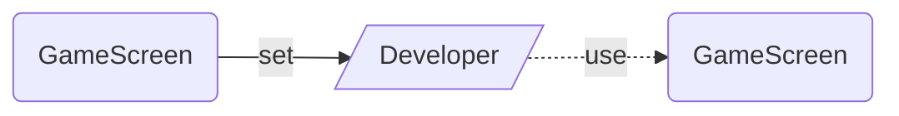
## g1Xold
  

## score
  
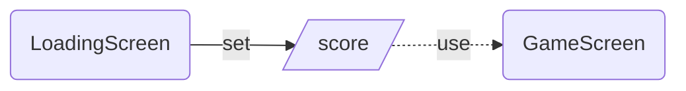
## g1Yold
  
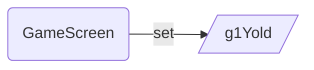
## g2Yold
  

## varInput
  
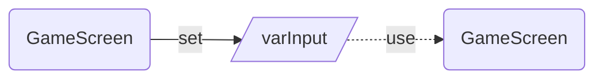
## g4Yold
  
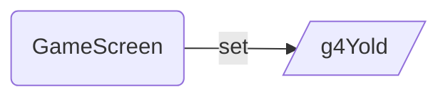
## fruitLive
  
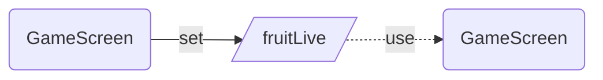
## g4Xold
  
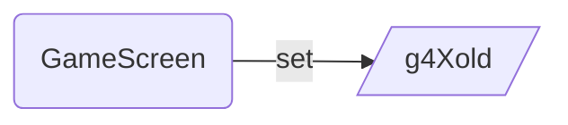
## Color4JSON
  
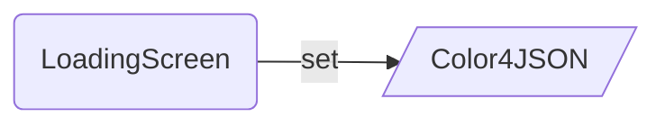
## startFruitTimer
  
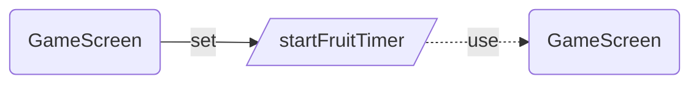
## StartLoadingScreenTimer
  
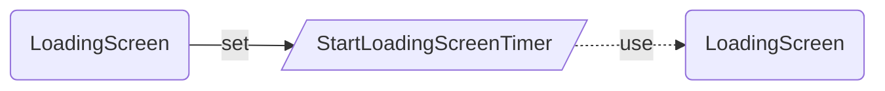
## gbl_menu_default
  
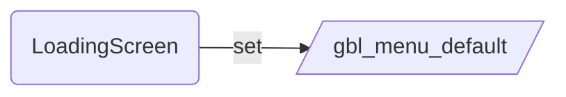
## g3Yold
  

## \nscore
  
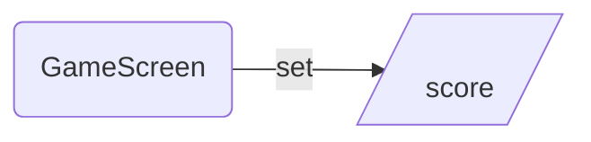
## varXold
  
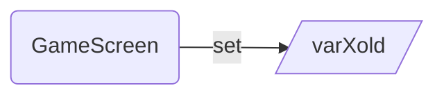
## varRefresh
  
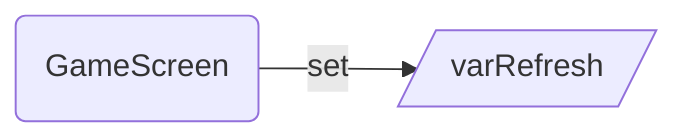
## LoadingText
  
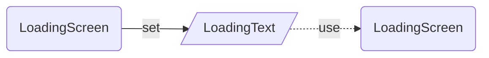
## fruitDuration
  
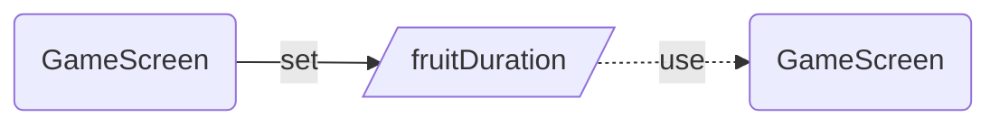
## g3Xold
  
```mermaid  
graph LR  
SetGameScreen(GameScreen)-- set -->g3Xold[/g3Xold/]  
```
## \nscore
  
```mermaid  
graph LR  
SetGameScreen(GameScreen)-- set -->\nscore[/\nscore/]  
```
## g2Xold
  
```mermaid  
graph LR  
SetGameScreen(GameScreen)-- set -->g2Xold[/g2Xold/]  
```
## varYold
  
```mermaid  
graph LR  
SetGameScreen(GameScreen)-- set -->varYold[/varYold/]  
```
# DataSources
  
---
|Name|Type|SetName|
| :--- | :--- | :--- |

## Collections
  
Usage of Collections is shown based on the screen(s) where this collection is created and the screen(s) where it is 
used. 
### colPillsNotEaten
  
```mermaid  
graph LR  
CreateLoadingScreen(LoadingScreen)-- create -->colPillsNotEaten[/colPillsNotEaten/]  
colPillsNotEaten[/colPillsNotEaten/]-. use .->UseLoadingScreen(LoadingScreen)  
colPillsNotEaten[/colPillsNotEaten/]-. use .->UseGameScreen(GameScreen)  
```
### \ncolDirectionsAvailableg2
  
```mermaid  
graph LR  
CreateGameScreen(GameScreen)-- create -->\ncolDirectionsAvailableg2[/\ncolDirectionsAvailableg2/]  
```
### \ncolDirectionsAvailableG1
  
```mermaid  
graph LR  
CreateGameScreen(GameScreen)-- create -->\ncolDirectionsAvailableG1[/\ncolDirectionsAvailableG1/]  
```
### \ncolPowerPills
  
```mermaid  
graph LR  
CreateGameScreen(GameScreen)-- create -->\ncolPowerPills[/\ncolPowerPills/]  
```
### ghostsHome
  
```mermaid  
graph LR  
CreateGameScreen(GameScreen)-- create -->ghostsHome[/ghostsHome/]  
ghostsHome[/ghostsHome/]-. use .->UseGameScreen(GameScreen)  
```
### colPowerPills
  
```mermaid  
graph LR  
CreateLoadingScreen(LoadingScreen)-- create -->colPowerPills[/colPowerPills/]  
colPowerPills[/colPowerPills/]-. use .->UseLoadingScreen(LoadingScreen)  
colPowerPills[/colPowerPills/]-. use .->UseGameScreen(GameScreen)  
```
### ghosts
  
```mermaid  
graph LR  
CreateLoadingScreen(LoadingScreen)-- create -->ghosts[/ghosts/]  
ghosts[/ghosts/]-. use .->UseLoadingScreen(LoadingScreen)  
ghosts[/ghosts/]-. use .->UseGameScreen(GameScreen)  
```
### colPills
  
```mermaid  
graph LR  
CreateLoadingScreen(LoadingScreen)-- create -->colPills[/colPills/]  
colPills[/colPills/]-. use .->UseLoadingScreen(LoadingScreen)  
colPills[/colPills/]-. use .->UseGameScreen(GameScreen)  
```
### fruits
  
```mermaid  
graph LR  
CreateLoadingScreen(LoadingScreen)-- create -->fruits[/fruits/]  
fruits[/fruits/]-. use .->UseLoadingScreen(LoadingScreen)  
fruits[/fruits/]-. use .->UseGameScreen(GameScreen)  
```
### \ncolDirectionsAvailableg3
  
```mermaid  
graph LR  
CreateGameScreen(GameScreen)-- create -->\ncolDirectionsAvailableg3[/\ncolDirectionsAvailableg3/]  
```
### \nlevelsCompleted
  
```mermaid  
graph LR  
CreateGameScreen(GameScreen)-- create -->\nlevelsCompleted[/\nlevelsCompleted/]  
```
### \ncolPills
  
```mermaid  
graph LR  
CreateGameScreen(GameScreen)-- create -->\ncolPills[/\ncolPills/]  
```
### \ncolDirectionsAvailableg4
  
```mermaid  
graph LR  
CreateGameScreen(GameScreen)-- create -->\ncolDirectionsAvailableg4[/\ncolDirectionsAvailableg4/]  
```
### colPowerPillsNotEaten
  
```mermaid  
graph LR  
CreateLoadingScreen(LoadingScreen)-- create -->colPowerPillsNotEaten[/colPowerPillsNotEaten/]  
colPowerPillsNotEaten[/colPowerPillsNotEaten/]-. use .->UseLoadingScreen(LoadingScreen)  
colPowerPillsNotEaten[/colPowerPillsNotEaten/]-. use .->UseGameScreen(GameScreen)  
```