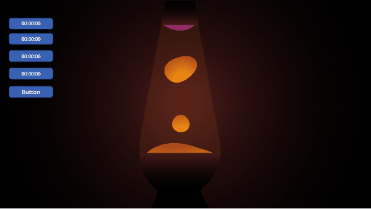

# Unfinished Projects

PowerApps and Power Platform Solutions used for learning that I still haven't finished!

Welcome to my unfinished projects repository, these are projects I know I don't currently have time to complete. As many people have asked how these were done I have decided to share the apps I build to learn with, hope you learn something from them too.

## Lava Lamp

Just a little SVG Lava lamp..

I created this by taking the example on codepen by [Chris Gannon](https://codepen.io/chrisgannon/pen/QjKXXe)
Used F12 Dev tools in Edge to work out what the javascript was updating in the DOM and the created timers to control the blobs moving up and down, and modified the image to use the dynamic values from the timers.

This doesn't use SVG Animation, purely CSS and dynamic values.
## PensPlace Pacman

I wanted to learn how to manipulate and animate SVGs in canvas apps aas I believe there is huge potential in making pixel perfect canvas apps using SVGs, I use SVGs all the time and if you need an SVG icon there are over 14000 in the Icon Menu Builder.

I grew up with games like Pacman and it was one of my favourites so I decided that it would be a good way learning by creating a lo-code version and I also wanted to prove to myself that you can literally build anything in canvas apps.

Whats provided:
- PowerApps Canvas App built on v3 template from [Sancho Harker](https://twitter.com/iAm_ManCat)
- [Documentation](Pacman/PensPlace%20Pacman-doc.md)

Things to do:

- Animate Pacman dying.
- Starting and Stopping Ghosts more efficiently.
- Fruits
- Saving scores
- better ghost ai

What you can learn:

- How to control SVGs using the keyboard ( thanks to [Robin Rosengrün](https://twitter.com/power_r2) ) using text input and togggle controls
- How to create a map of available directions using excel and importing as a static data source.
- Use Concat in SVGs to create the pills and power pills image
- How to test collisions, eating pills catching ghosts, pacman caught
- How to use timers to control SVG animations